# Lslidar ROS2 Driver 상세 분석

## 소스 코드 구조 분석

### 주요 소스 파일

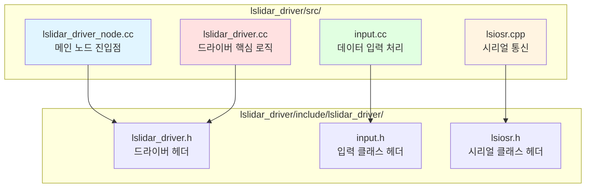

## 데이터 처리 파이프라인

### 패킷 처리 흐름

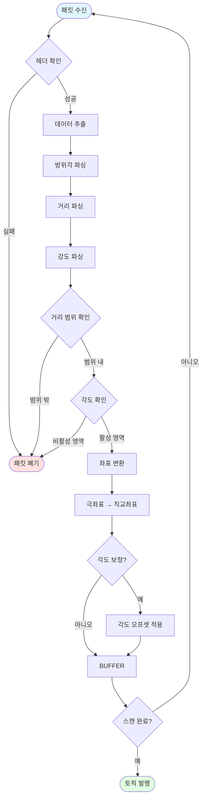

## 네트워크 프로토콜 분석

### MSOP (Measurement Output Packet)

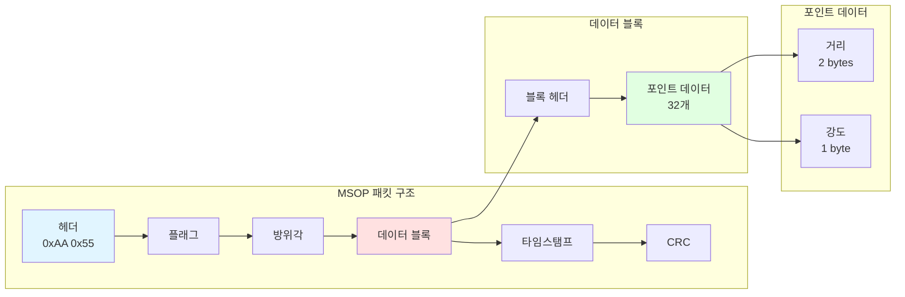

### DIFOP (Device Info Output Packet)

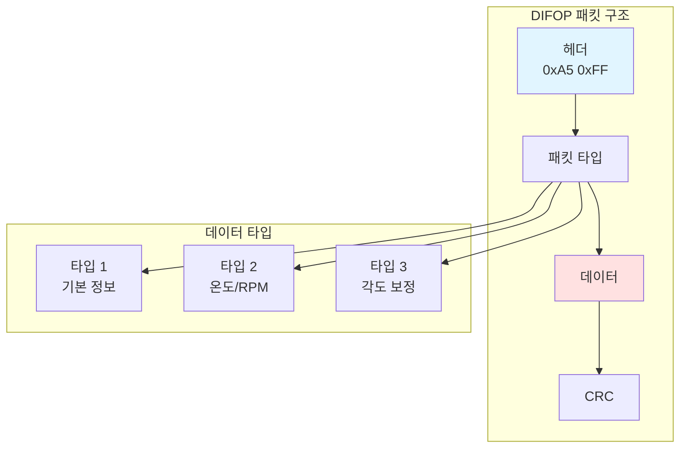

## 좌표 변환 수학

### 극좌표에서 직교좌표로

```mermaid
graph TB
    subgraph "입력"
        R[거리 r]
        THETA[방위각 θ]
        PHI[고도각 φ]
    end

    subgraph "변환"
        X[x = r × cos(φ) × sin(θ)]
        Y[y = r × cos(φ) × cos(θ)]
        Z[z = r × sin(φ)]
    end

    subgraph "출력"
        POINT[PointXYZIT]
    end

    R --> X
    R --> Y
    R --> Z
    THETA --> X
    THETA --> Y
    PHI --> X
    PHI --> Y
    PHI --> Z

    X --> POINT
    Y --> POINT
    Z --> POINT

    style R fill:#e1f5ff
    style THETA fill:#ffe1e1
    style PHI fill:#e1ffe1
    style POINT fill:#fff4e1
```

## 시리얼 통신 분석

### 시리얼 포트 설정

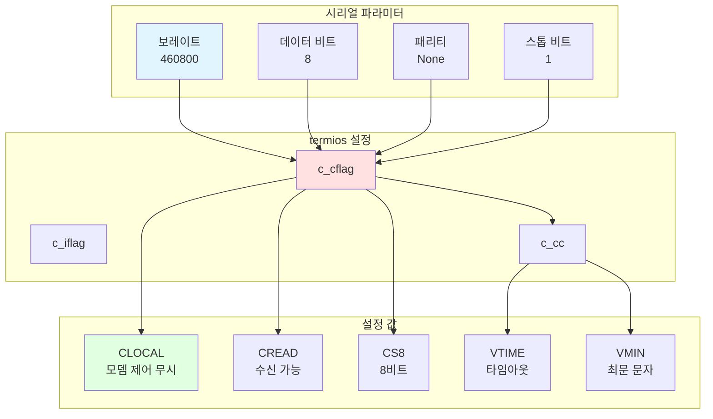

## 스레드 동기화 메커니즘

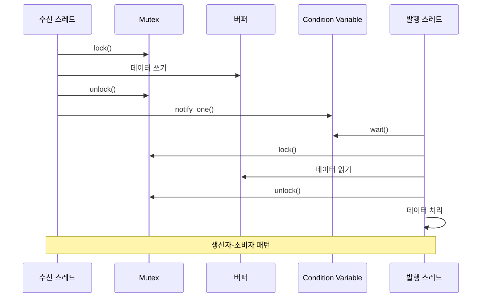

## 진단 시스템 상세

### 진단 항목 및 임계값

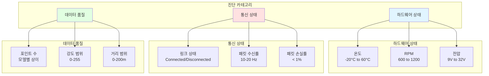

## 파라미터 상세 분석

### 필수 파라미터

| 파라미터 | 타입 | 기본값 | 설명 |
|---------|------|--------|------|
| `device_ip` | string | 192.168.1.200 | 라이다 IP 주소 |
| `msop_port` | int | 2368 | MSOP 데이터 포트 |
| `lidar_name` | string | M10 | 라이다 모델 |
| `frame_id` | string | laser_link | 좌표 프레임 ID |

### 선택적 파라미터

| 파라미터 | 타입 | 기본값 | 설명 |
|---------|------|--------|------|
| `min_range` | double | 0.0 | 최소 거리 (m) |
| `max_range` | double | 200.0 | 최대 거리 (m) |
| `angle_disable_min` | double | 0.0 | 비활성 각도 시작 (도) |
| `angle_disable_max` | double | 0.0 | 비활성 각도 끝 (도) |
| `use_gps_ts` | bool | false | GPS 타임스탬프 사용 |
| `compensation` | bool | false | 각도 보정 사용 |

## 성능 특성

### 시스템 성능

```mermaid
graph TB
    subgraph "성능 지표"
        LATENCY[지연 시간<br/>less than 50ms]
        THROUGHPUT[처리량<br/>about 400K points/s]
        CPU[CPU 사용량<br/>less than 20%]
        MEMORY[메모리 사용량<br/>less than 100MB]
    end

    subgraph "네트워크"
        BANDWIDTH[대역폭<br/>about 10 Mbps]
        PACKET_SIZE[패킷 크기<br/>about 1200 bytes]
        PACKET_RATE[패킷률<br/>10-20 Hz]
    end

    subgraph "출력"
        SCAN_RATE[스캔률<br/>10-20 Hz]
        POINTS_PER_SCAN[포인트/스캔<br/>about 20000]
        TOPIC_RATE[토픽률<br/>10-20 Hz]
    end

    LATENCY --> THROUGHPUT
    THROUGHPUT --> CPU
    CPU --> MEMORY

    BANDWIDTH --> PACKET_SIZE
    PACKET_SIZE --> PACKET_RATE

    SCAN_RATE --> POINTS_PER_SCAN
    POINTS_PER_SCAN --> TOPIC_RATE

    style LATENCY fill:#e1f5ff
    style BANDWIDTH fill:#ffe1e1
    style SCAN_RATE fill:#e1ffe1
```

## 트러블슈팅 가이드

### 일반적인 문제 및 해결책

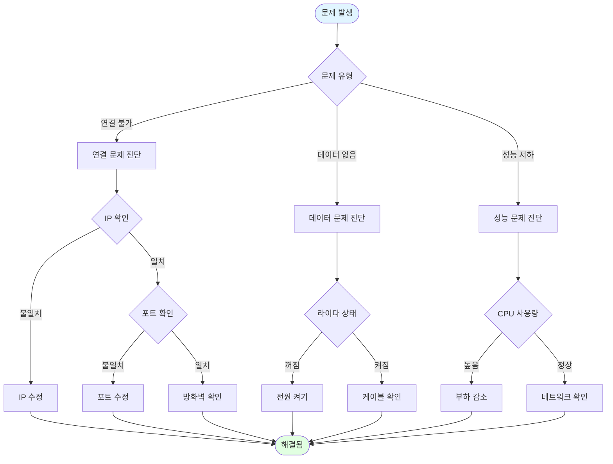

## 확장 가능성

### 플러그인 아키텍처

```mermaid
graph TB
    subgraph "코어 드라이버"
        CORE[LslidarDriver]
        INPUT_BASE[Input]
    end

    subgraph "플러그인"
        SOCKET[InputSocket]
        PCAP[InputPCAP]
        CUSTOM[CustomInput]
    end

    subgraph "확장 포인트"
        DATA_SOURCE[데이터 소스]
        PARSER[파서]
        FILTER[필터]
        OUTPUT[출력]
    end

    CORE --> INPUT_BASE
    INPUT_BASE <|-- SOCKET
    INPUT_BASE <|-- PCAP
    INPUT_BASE <|-- CUSTOM

    CORE --> DATA_SOURCE
    CORE --> PARSER
    CORE --> FILTER
    CORE --> OUTPUT

    style CORE fill:#e1f5ff
    style SOCKET fill:#ffe1e1
    style PCAP fill:#e1ffe1
    style CUSTOM fill:#fff4e1
```

## 테스트 전략

### 테스트 계층

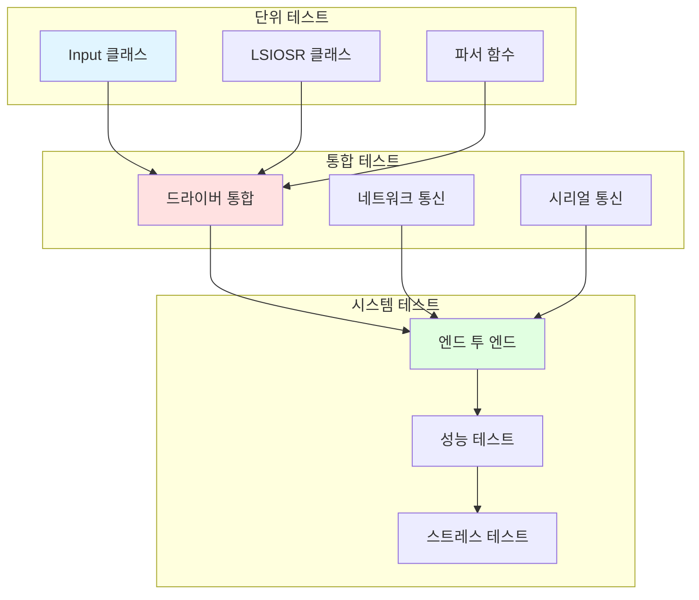

## 보안 고려사항

### 보안 위험 및 완화

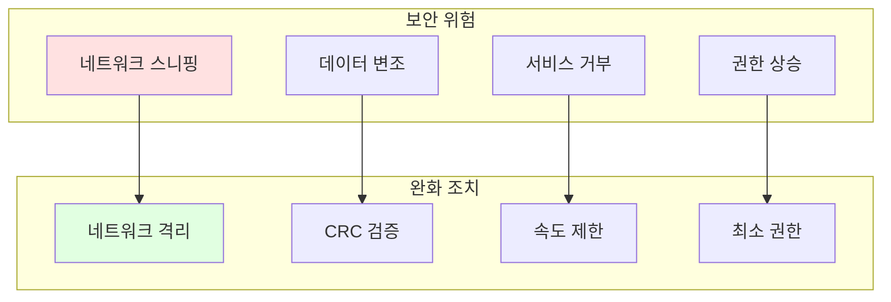

## 향후 개선 방향

### 제안된 개선사항

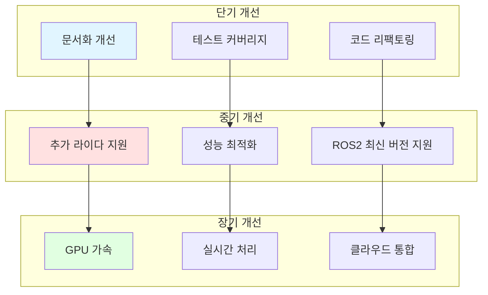

## 참고 자료

- ROS2 문서: https://docs.ros.org/
- Leishen 라이다 문서: honghangli@lslidar.com
- PCL 라이브러리: https://pointclouds.org/
- diagnostic_updater: https://index.ros.org/p/diagnostic_updater/