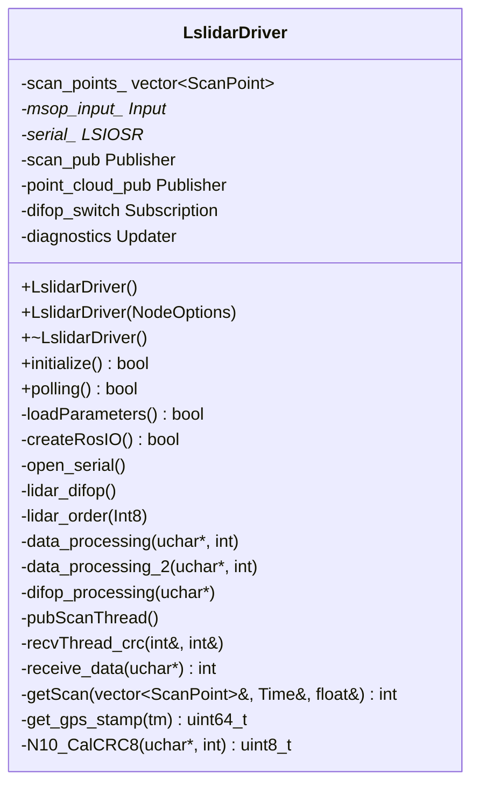
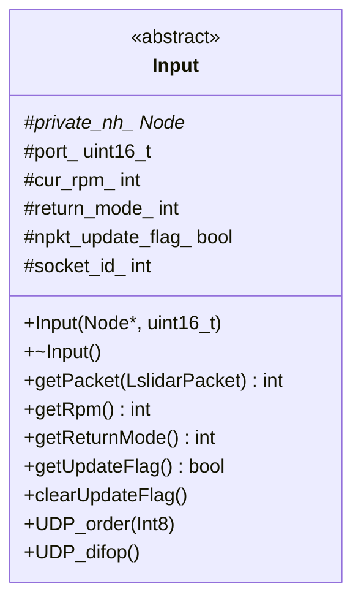
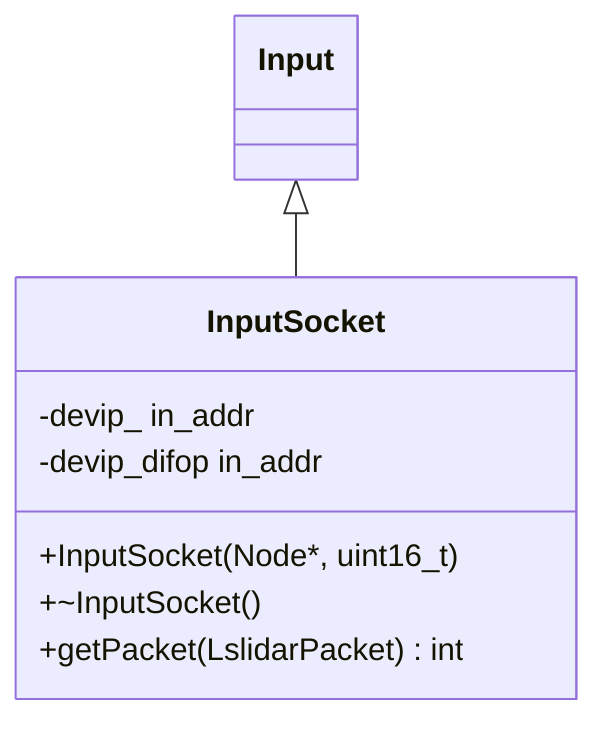
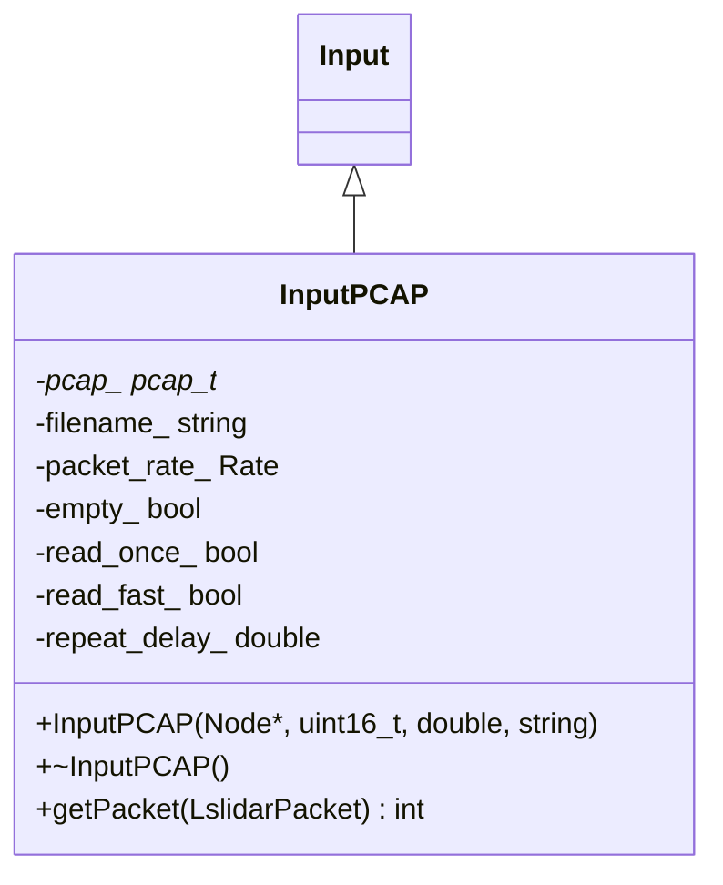
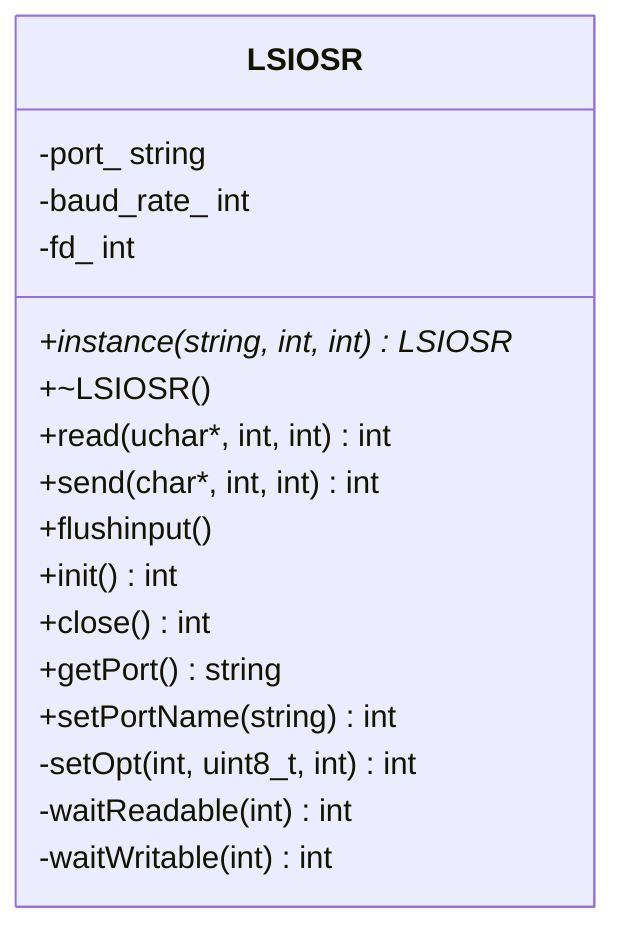
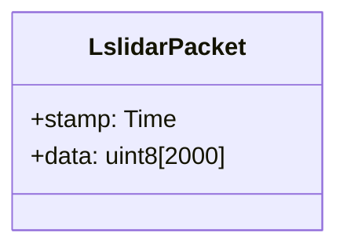
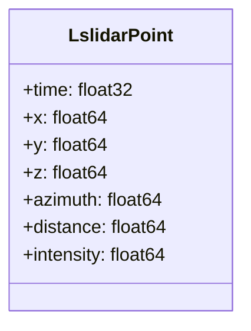
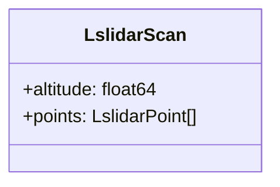
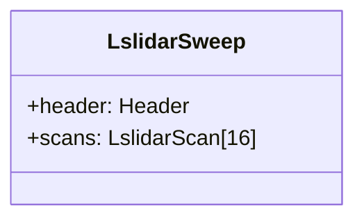
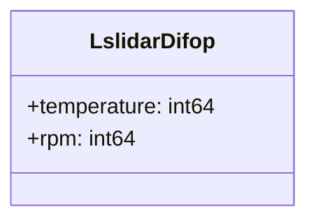

# Lslidar ROS2 Driver API 참조

## 클래스 참조

### LslidarDriver



#### 생성자

```cpp
LslidarDriver::LslidarDriver()
```

기본 생성자입니다.

```cpp
LslidarDriver::LslidarDriver(const rclcpp::NodeOptions& options)
```

노드 옵션을 받는 생성자입니다.

**매개변수:**
- `options`: ROS2 노드 옵션

#### 소멸자

```cpp
LslidarDriver::~LslidarDriver()
```

소멸자입니다. 리소스를 정리합니다.

#### 메서드

##### initialize()

```cpp
bool LslidarDriver::initialize()
```

드라이버를 초기화합니다.

**반환값:**
- `true`: 초기화 성공
- `false`: 초기화 실패

**초기화 순서:**
1. 파라미터 로드
2. ROS I/O 생성
3. 시리얼 포트 열기 (필요한 경우)
4. 스레드 시작

##### polling()

```cpp
bool LslidarDriver::polling()
```

메인 폴링 루프입니다. 데이터를 수신하고 처리합니다.

**반환값:**
- `true`: 계속 실행
- `false`: 종료

##### loadParameters()

```cpp
bool LslidarDriver::loadParameters()
```

파라미터를 로드합니다.

**반환값:**
- `true`: 로드 성공
- `false`: 로드 실패

**로드되는 파라미터:**
- 네트워크 설정 (IP, 포트)
- 시리얼 설정 (포트, 보레이트)
- 라이다 설정 (모델, 프레임 ID)
- 데이터 설정 (거리, 각도)
- 토픽 설정 (이름, 발행 여부)

##### createRosIO()

```cpp
bool LslidarDriver::createRosIO()
```

ROS 토픽/서비스를 생성합니다.

**반환값:**
- `true`: 생성 성공
- `false`: 생성 실패

**생성되는 토픽:**
- `/scan`: LaserScan 토픽
- `/lslidar_point_cloud`: PointCloud2 토픽
- `/diagnostics`: 진단 토픽

**생성되는 서비스:**
- `/lslidar_order`: 라이다 제어 서비스

##### open_serial()

```cpp
void LslidarDriver::open_serial()
```

시리얼 포트를 엽니다.

##### lidar_difop()

```cpp
void LslidarDriver::lidar_difop()
```

DIFOP 데이터를 처리합니다.

##### lidar_order()

```cpp
void LslidarDriver::lidar_order(const std_msgs::msg::Int8::SharedPtr msg)
```

라이다 제어 명령을 처리합니다.

**매개변수:**
- `msg`: 제어 명령 (1: 켜기, 0: 끄기)

##### data_processing()

```cpp
void LslidarDriver::data_processing(unsigned char *packet_bytes, int len)
```

MSOP 패킷을 처리합니다.

**매개변수:**
- `packet_bytes`: 패킷 데이터
- `len`: 패킷 길이

##### data_processing_2()

```cpp
void LslidarDriver::data_processing_2(unsigned char *packet_bytes, int len)
```

MSOP 패킷을 처리합니다 (대체 방식).

**매개변수:**
- `packet_bytes`: 패킷 데이터
- `len`: 패킷 길이

##### difop_processing()

```cpp
void LslidarDriver::difop_processing(unsigned char *packet_bytes)
```

DIFOP 패킷을 처리합니다.

**매개변수:**
- `packet_bytes`: 패킷 데이터

##### pubScanThread()

```cpp
void LslidarDriver::pubScanThread()
```

스캔 데이터 발행 스레드입니다.

##### recvThread_crc()

```cpp
void LslidarDriver::recvThread_crc(int &count, int &link_time)
```

데이터 수신 스레드입니다.

**매개변수:**
- `count`: 패킷 카운터
- `link_time`: 링크 시간

##### receive_data()

```cpp
int LslidarDriver::receive_data(unsigned char *packet_bytes)
```

데이터를 수신합니다.

**매개변수:**
- `packet_bytes`: 수신 버퍼

**반환값:**
- 수신된 바이트 수

##### getScan()

```cpp
int LslidarDriver::getScan(std::vector<ScanPoint> &points, rclcpp::Time &scan_time, float &scan_duration)
```

스캔 데이터를 가져옵니다.

**매개변수:**
- `points`: 스캔 포인트 벡터
- `scan_time`: 스캔 시간
- `scan_duration`: 스캔 지속 시간

**반환값:**
- 포인트 수

##### get_gps_stamp()

```cpp
uint64_t LslidarDriver::get_gps_stamp(struct tm t)
```

GPS 타임스탬프를 가져옵니다.

**매개변수:**
- `t`: 시간 구조체

**반환값:**
- GPS 타임스탬프

##### N10_CalCRC8()

```cpp
uint8_t LslidarDriver::N10_CalCRC8(unsigned char * p, int len)
```

CRC8을 계산합니다.

**매개변수:**
- `p`: 데이터 포인터
- `len`: 데이터 길이

**반환값:**
- CRC8 값

### Input



#### 생성자

```cpp
Input::Input(rclcpp::Node* private_nh, uint16_t port)
```

입력 객체를 생성합니다.

**매개변수:**
- `private_nh`: ROS2 노드 핸들
- `port`: 포트 번호

#### 메서드

##### getPacket()

```cpp
virtual int Input::getPacket(lslidar_msgs::msg::LslidarPacket::UniquePtr &packet) = 0
```

패킷을 가져옵니다 (순수 가상 함수).

**매개변수:**
- `packet`: 패킷 포인터

**반환값:**
- `0`: 성공
- `-1`: 파일 끝
- `>0`: 불완전한 패킷

##### getRpm()

```cpp
int Input::getRpm()
```

RPM을 가져옵니다.

**반환값:**
- RPM 값

##### getReturnMode()

```cpp
int Input::getReturnMode()
```

반환 모드를 가져옵니다.

**반환값:**
- 반환 모드

##### getUpdateFlag()

```cpp
bool Input::getUpdateFlag()
```

업데이트 플래그를 가져옵니다.

**반환값:**
- 업데이트 플래그

##### clearUpdateFlag()

```cpp
void Input::clearUpdateFlag()
```

업데이트 플래그를 지웁니다.

##### UDP_order()

```cpp
void Input::UDP_order(const std_msgs::msg::Int8 msg)
```

UDP 제어 명령을 보냅니다.

**매개변수:**
- `msg`: 제어 명령

##### UDP_difop()

```cpp
void Input::UDP_difop()
```

UDP DIFOP를 처리합니다.

### InputSocket



#### 생성자

```cpp
InputSocket::InputSocket(rclcpp::Node* private_nh, uint16_t port = MSOP_DATA_PORT_NUMBER)
```

소켓 입력 객체를 생성합니다.

**매개변수:**
- `private_nh`: ROS2 노드 핸들
- `port`: 포트 번호 (기본값: 2368)

#### 메서드

##### getPacket()

```cpp
int InputSocket::getPacket(lslidar_msgs::msg::LslidarPacket::UniquePtr &packet)
```

소켓에서 패킷을 가져옵니다.

**매개변수:**
- `packet`: 패킷 포인터

**반환값:**
- `0`: 성공
- `-1`: 오류
- `>0`: 불완전한 패킷

### InputPCAP



#### 생성자

```cpp
InputPCAP::InputPCAP(rclcpp::Node* private_nh, uint16_t port = MSOP_DATA_PORT_NUMBER, double packet_rate = 0.0, std::string filename="")
```

PCAP 입력 객체를 생성합니다.

**매개변수:**
- `private_nh`: ROS2 노드 핸들
- `port`: 포트 번호 (기본값: 2368)
- `packet_rate`: 패킷 속도
- `filename`: PCAP 파일 경로

#### 메서드

##### getPacket()

```cpp
int InputPCAP::getPacket(lslidar_msgs::msg::LslidarPacket::UniquePtr &pkt)
```

PCAP 파일에서 패킷을 가져옵니다.

**매개변수:**
- `pkt`: 패킷 포인터

**반환값:**
- `0`: 성공
- `-1`: 파일 끝
- `>0`: 불완전한 패킷

### LSIOSR



#### 정적 메서드

##### instance()

```cpp
static LSIOSR* LSIOSR::instance(std::string name, int speed, int fd = 0)
```

싱글톤 인스턴스를 가져옵니다.

**매개변수:**
- `name`: 포트 이름
- `speed`: 보레이트
- `fd`: 파일 디스크립터

**반환값:**
- LSIOSR 인스턴스 포인터

#### 메서드

##### read()

```cpp
int LSIOSR::read(unsigned char *buffer, int length, int timeout = 30)
```

시리얼 포트에서 데이터를 읽습니다.

**매개변수:**
- `buffer`: 읽기 버퍼
- `length`: 읽기 길이
- `timeout`: 타임아웃 (초, 기본값: 30)

**반환값:**
- 읽은 바이트 수

##### send()

```cpp
int LSIOSR::send(const char* buffer, int length, int timeout = 30)
```

시리얼 포트로 데이터를 보냅니다.

**매개변수:**
- `buffer`: 쓰기 버퍼
- `length`: 쓰기 길이
- `timeout`: 타임아웃 (초, 기본값: 30)

**반환값:**
- 쓴 바이트 수

##### flushinput()

```cpp
void LSIOSR::flushinput()
```

입력 버퍼를 비웁니다.

##### init()

```cpp
int LSIOSR::init()
```

시리얼 포트를 초기화합니다.

**반환값:**
- `0`: 성공
- `-1`: 실패

##### close()

```cpp
int LSIOSR::close()
```

시리얼 포트를 닫습니다.

**반환값:**
- `0`: 성공

##### getPort()

```cpp
std::string LSIOSR::getPort()
```

포트 이름을 가져옵니다.

**반환값:**
- 포트 이름

##### setPortName()

```cpp
int LSIOSR::setPortName(std::string name)
```

포트 이름을 설정합니다.

**매개변수:**
- `name`: 포트 이름

**반환값:**
- `0`: 성공

## 메시지 참조

### LslidarPacket



**필드:**
- `stamp`: 패킷 타임스탬프
- `data`: 패킷 데이터 (최대 2000 바이트)

### LslidarPoint



**필드:**
- `time`: 포인트 캡처 시간
- `x`: X 좌표
- `y`: Y 좌표
- `z`: Z 좌표
- `azimuth`: 방위각 (도)
- `distance`: 거리 (미터)
- `intensity`: 강도

### LslidarScan



**필드:**
- `altitude`: 고도
- `points`: 포인트 배열

### LslidarSweep



**필드:**
- `header`: 헤더
- `scans`: 스캔 배열 (16개)

### LslidarDifop



**필드:**
- `temperature`: 온도
- `rpm`: RPM

## 토픽 참조

### 발행 토픽

#### /scan

**타입:** `sensor_msgs/msg/LaserScan`

**설명:** 라이다 스캔 데이터

**필드:**
- `header`: 메시지 헤더
- `angle_min`: 최소 각도 (라디안)
- `angle_max`: 최대 각도 (라디안)
- `angle_increment`: 각도 증분 (라디안)
- `time_increment`: 시간 증분 (초)
- `scan_time`: 스캔 시간 (초)
- `range_min`: 최소 거리 (미터)
- `range_max`: 최대 거리 (미터)
- `ranges`: 거리 배열
- `intensities`: 강도 배열

#### /lslidar_point_cloud

**타입:** `sensor_msgs/msg/PointCloud2`

**설명:** 라이다 포인트 클라우드 데이터

**필드:**
- `header`: 메시지 헤더
- `height`: 높이
- `width`: 너비
- `fields`: 필드 배열
- `is_bigendian`: 빅 엔디안 여부
- `point_step`: 포인트당 바이트 수
- `row_step`: 행당 바이트 수
- `data`: 데이터 배열
- `is_dense`: 밀도 여부

#### /diagnostics

**타입:** `diagnostic_msgs/msg/DiagnosticArray`

**설명:** 진단 데이터

### 구독 토픽

#### /lslidar_order

**타입:** `std_msgs/msg/Int8`

**설명:** 라이다 제어 명령

**값:**
- `1`: 라이다 켜기
- `0`: 라이다 끄기

## 서비스 참조

### 라이프사이클 서비스

#### /lslidar_driver_node/...

**타입:** `lifecycle_msgs/srv/...`

**설명:** 라이프사이클 노드 제어

**서비스:**
- `configure`: 노드 구성
- `activate`: 노드 활성화
- `deactivate`: 노드 비활성화
- `cleanup`: 노드 정리
- `shutdown`: 노드 종료

## 파라미터 참조

### 네트워크 파라미터

| 파라미터 | 타입 | 기본값 | 설명 |
|---------|------|--------|------|
| `device_ip` | string | 192.168.1.200 | 라이다 IP 주소 |
| `device_ip_difop` | string | 192.168.1.102 | DIFOP IP 주소 |
| `msop_port` | int | 2368 | MSOP 데이터 포트 |
| `difop_port` | int | 2369 | DIFOP 데이터 포트 |
| `group_ip` | string | 224.1.1.2 | 멀티캐스트 그룹 IP |
| `add_multicast` | bool | false | 멀티캐스트 사용 여부 |

### 시리얼 파라미터

| 파라미터 | 타입 | 기본값 | 설명 |
|---------|------|--------|------|
| `interface_selection` | string | serial | 인터페이스 선택 (net/serial) |
| `serial_port_` | string | /dev/ttyUSB0 | 시리얼 포트 경로 |

### 라이다 파라미터

| 파라미터 | 타입 | 기본값 | 설명 |
|---------|------|--------|------|
| `lidar_name` | string | M10 | 라이다 모델 |
| `frame_id` | string | laser_link | 좌표 프레임 ID |
| `high_reflection` | bool | false | 고반사 모드 (M10_P) |
| `compensation` | bool | false | 각도 보정 사용 |

### 데이터 파라미터

| 파라미터 | 타입 | 기본값 | 설명 |
|---------|------|--------|------|
| `min_range` | double | 0.0 | 최소 거리 (m) |
| `max_range` | double | 200.0 | 최대 거리 (m) |
| `angle_disable_min` | double | 0.0 | 비활성 각도 시작 (도) |
| `angle_disable_max` | double | 0.0 | 비활성 각도 끝 (도) |
| `use_gps_ts` | bool | false | GPS 타임스탬프 사용 |

### 토픽 파라미터

| 파라미터 | 타입 | 기본값 | 설명 |
|---------|------|--------|------|
| `scan_topic` | string | /scan | LaserScan 토픽 이름 |
| `pointcloud_topic` | string | /lslidar_point_cloud | PointCloud2 토픽 이름 |
| `pubScan` | bool | true | LaserScan 발행 여부 |
| `pubPointCloud2` | bool | false | PointCloud2 발행 여부 |

## 예제 코드

### 기본 사용

```cpp
#include <rclcpp/rclcpp.hpp>
#include "lslidar_driver/lslidar_driver.h"

int main(int argc, char** argv) {
    rclcpp::init(argc, argv);

    // 드라이버 노드 생성
    auto driver = std::make_shared<lslidar_driver::LslidarDriver>();

    // 초기화
    if (!driver->initialize()) {
        RCLCPP_ERROR(driver->get_logger(), "드라이버 초기화 실패");
        return -1;
    }

    // 폴링 루프
    while (rclcpp::ok()) {
        driver->polling();
        rclcpp::spin_some(driver);
    }

    rclcpp::shutdown();
    return 0;
}
```

### 커스텀 노드

```cpp
#include <rclcpp/rclcpp.hpp>
#include <sensor_msgs/msg/laser_scan.hpp>

class CustomLidarNode : public rclcpp::Node {
public:
    CustomLidarNode() : Node("custom_lidar_node") {
        // LaserScan 토픽 구독
        scan_sub_ = this->create_subscription<sensor_msgs::msg::LaserScan>(
            "/scan", 10,
            std::bind(&CustomLidarNode::scanCallback, this, std::placeholders::_1)
        );
    }

private:
    void scanCallback(const sensor_msgs::msg::LaserScan::SharedPtr msg) {
        // 스캔 데이터 처리
        RCLCPP_INFO(this->get_logger(), "스캔 수신: %zu 포인트", msg->ranges.size());

        // 데이터 처리 로직
        for (size_t i = 0; i < msg->ranges.size(); ++i) {
            double range = msg->ranges[i];
            double angle = msg->angle_min + i * msg->angle_increment;

            // 유효한 거리 확인
            if (range >= msg->range_min && range <= msg->range_max) {
                // 포인트 처리
                processPoint(range, angle);
            }
        }
    }

    void processPoint(double range, double angle) {
        // 포인트 처리 로직
        double x = range * cos(angle);
        double y = range * sin(angle);

        RCLCPP_DEBUG(this->get_logger(), "포인트: (%.2f, %.2f)", x, y);
    }

    rclcpp::Subscription<sensor_msgs::msg::LaserScan>::SharedPtr scan_sub_;
};

int main(int argc, char** argv) {
    rclcpp::init(argc, argv);
    auto node = std::make_shared<CustomLidarNode>();
    rclcpp::spin(node);
    rclcpp::shutdown();
    return 0;
}
```

## 참고 자료

- ROS2 C++ API: https://docs.ros.org/en/foxy/APIs/cpp.html
- sensor_msgs: https://docs.ros.org/en/foxy/api/sensor_msgs/
- PCL: https://pointclouds.org/documentation/