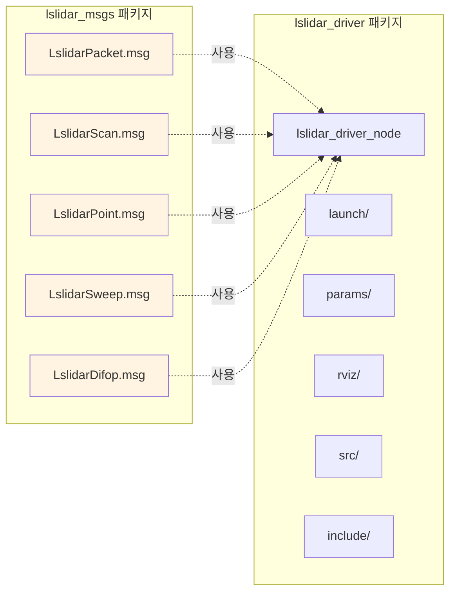
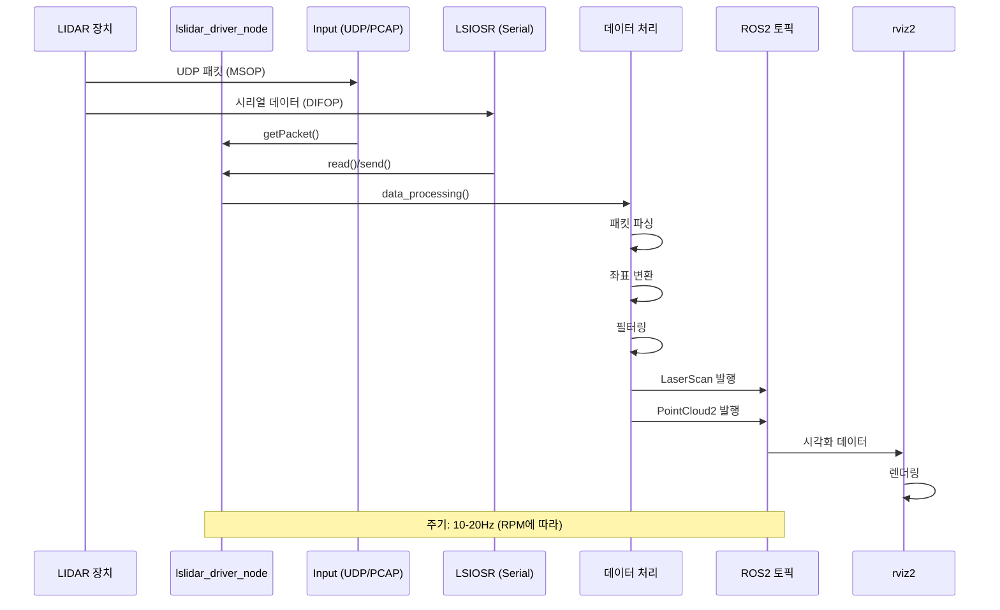
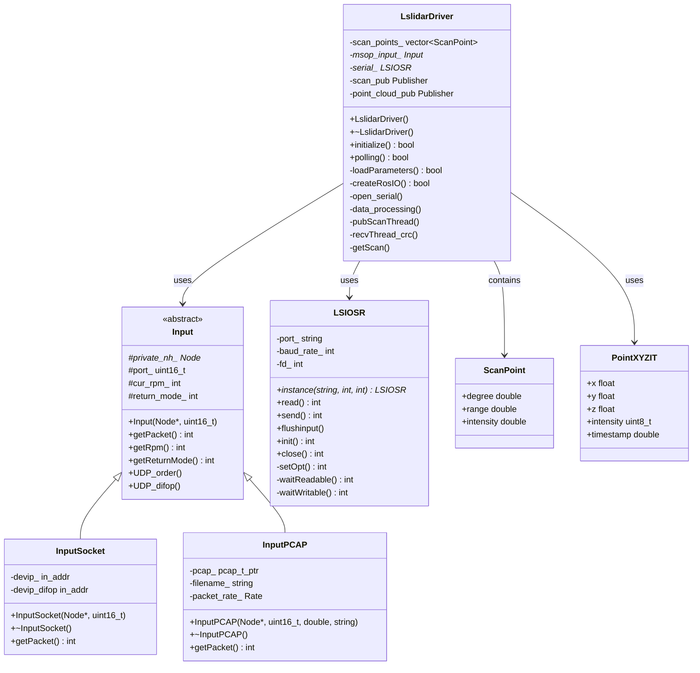
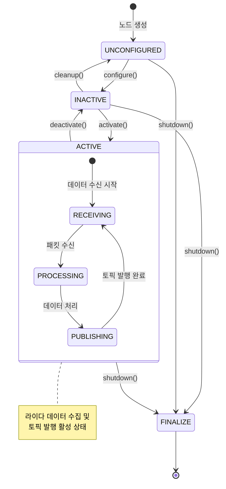
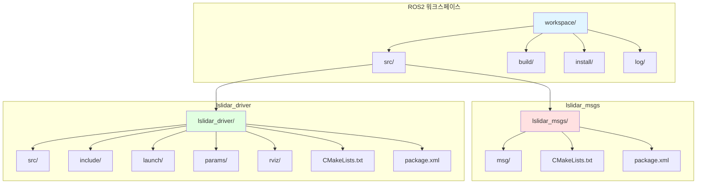
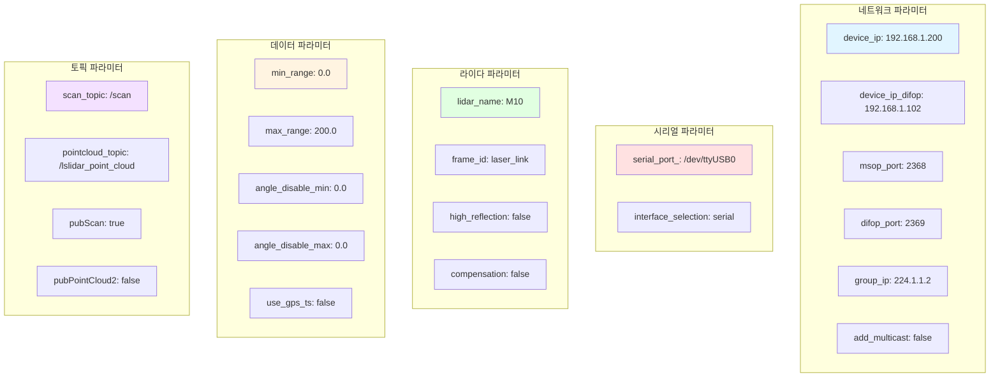
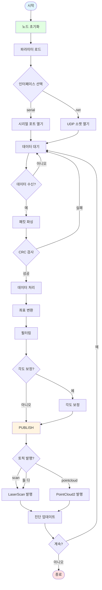
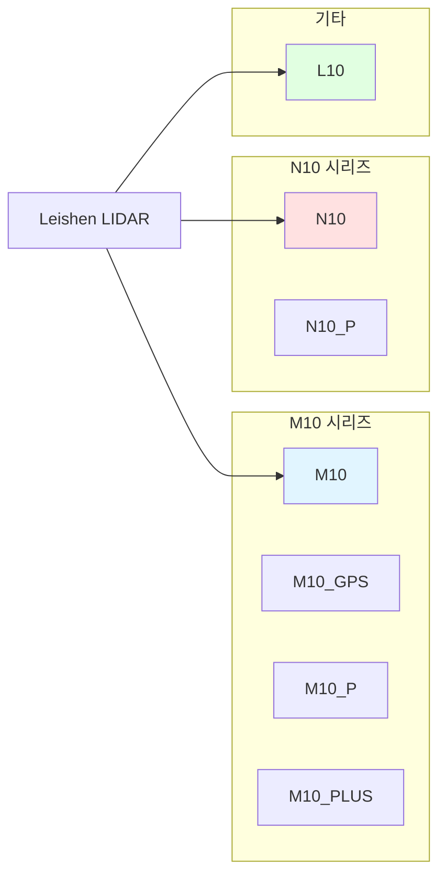
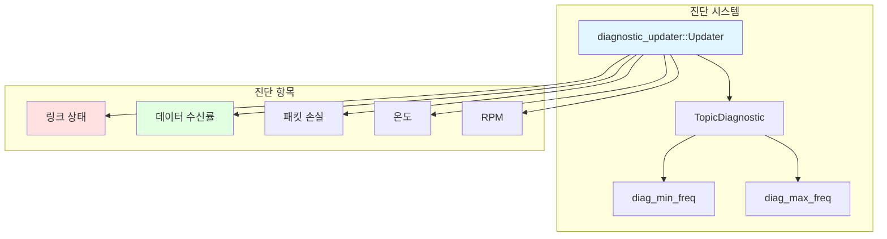

# Lslidar ROS2 Driver 아키텍처 문서

## 개요

Lslidar ROS2 Driver는 Leishen(雷神) M10, M10_GPS, M10_P, M10_PLUS, N10 시리즈 라이다를 위한 ROS2 드라이버입니다. Ubuntu 20.04와 ROS2 FOXY에서 테스트되었습니다.

## 시스템 아키텍처

```mermaid
graph TB
    subgraph "하드웨어 계층"
        LIDAR[Leishen LIDAR<br/>M10/N10 시리즈]
        SERIAL[시리얼 포트<br/>/dev/ttyUSB0]
        NETWORK[네트워크<br/>UDP 2368/2369]
    end

    subgraph "ROS2 노드 계층"
        DRIVER[lslidar_driver_node<br/>LifecycleNode]
        RVIZ[rviz2<br/>시각화]
    end

    subgraph "드라이버 내부 구성요소"
        INPUT[Input<br/>데이터 수집]
        OSR[LSIOSR<br/>시리얼 통신]
        PROCESSOR[데이터 처리<br/>파싱/변환]
        PUBLISHER[토픽 발행]
    end

    subgraph "ROS2 토픽/서비스"
        SCAN[/scan<br/>LaserScan]
        POINTCLOUD[/lslidar_point_cloud<br/>PointCloud2]
        ORDER[/lslidar_order<br/>Int8]
        DIAGNOSTICS[/diagnostics<br/>diagnostic_msgs]
    end

    LIDAR -->|UDP| NETWORK
    LIDAR -->|시리얼| SERIAL
    NETWORK --> INPUT
    SERIAL --> OSR
    INPUT --> PROCESSOR
    OSR --> PROCESSOR
    PROCESSOR --> PUBLISHER
    PUBLISHER --> SCAN
    PUBLISHER --> POINTCLOUD
    ORDER --> DRIVER
    SCAN --> RVIZ
    POINTCLOUD --> RVIZ
    DRIVER --> DIAGNOSTICS

    style DRIVER fill:#e1f5ff
    style LIDAR fill:#ffe1e1
    style RVIZ fill:#e1ffe1
```

## 패키지 구조



## 데이터 흐름



## 클래스 다이어그램



## 메시지 구조

```mermaid
graph TB
    subgraph "LslidarPacket"
        PKT_STAMP[stamp: Time]
        PKT_DATA[data: uint8[2000]]
    end

    subgraph "LslidarPoint"
        PT_TIME[time: float32]
        PT_X[x: float64]
        PT_Y[y: float64]
        PT_Z[z: float64]
        PT_AZIMUTH[azimuth: float64]
        PT_DISTANCE[distance: float64]
        PT_INTENSITY[intensity: float64]
    end

    subgraph "LslidarScan"
        SC_ALT[altitude: float64]
        SC_POINTS[points: LslidarPoint[]]
    end

    subgraph "LslidarSweep"
        SW_HEADER[header: std_msgs/Header]
        SW_SCANS[scans: LslidarScan[16]]
    end

    subgraph "LslidarDifop"
        DF_TEMP[temperature: int64]
        DF_RPM[rpm: int64]
    end

    SW_SCANS --> SC_POINTS
    SC_POINTS --> PT_TIME
    SC_POINTS --> PT_X
    SC_POINTS --> PT_Y
    SC_POINTS --> PT_Z

    style PKT_STAMP fill:#e1f5ff
    style PT_TIME fill:#e1f5ff
    style SC_ALT fill:#e1f5ff
    style SW_HEADER fill:#e1f5ff
```

## 네트워크 통신 구조

```mermaid
graph LR
    subgraph "LIDAR 장치"
        LIDAR_IP[192.168.1.200<br/>MSOP 데이터]
        LIDAR_DIFOP[192.168.1.102<br/>DIFOP 데이터]
    end

    subgraph "PC/로봇"
        PC_IP[192.168.1.x]
        MSOP_PORT[UDP 2368<br/>MSOP 수신]
        DIFOP_PORT[UDP 2369<br/>DIFOP 수신]
        SERIAL[/dev/ttyUSB0<br/>시리얼 통신]
    end

    subgraph "멀티캐스트 옵션"
        GROUP[224.1.1.2<br/>멀티캐스트 그룹]
    end

    LIDAR_IP -->|UDP| MSOP_PORT
    LIDAR_DIFOP -->|UDP| DIFOP_PORT
    LIDAR_DIFOP -->|시리얼| SERIAL

    MSOP_PORT -.->|선택적| GROUP
    DIFOP_PORT -.->|선택적| GROUP

    style LIDAR_IP fill:#ffe1e1
    style LIDAR_DIFOP fill:#ffe1e1
    style PC_IP fill:#e1ffe1
```

## 스레드 구조

```mermaid
graph TB
    subgraph "메인 스레드"
        MAIN[메인 루프<br/>polling()]
        INIT[initialize()]
        PARAM[loadParameters()]
        IO[createRosIO()]
    end

    subgraph "수신 스레드"
        RECV[recvThread_crc()]
        PACKET[getPacket()]
        CRC[CRC 검사]
    end

    subgraph "발행 스레드"
        PUB[pubScanThread()]
        SCAN[getScan()]
        CONVERT[좌표 변환]
        PUBLISH[토픽 발행]
    end

    subgraph "동기화"
        MUTEX[mutex_]
        COND[pubscan_cond_]
    end

    MAIN --> INIT
    INIT --> PARAM
    PARAM --> IO
    IO --> RECV
    IO --> PUB

    RECV --> PACKET
    PACKET --> CRC
    CRC --> MUTEX

    PUB --> SCAN
    SCAN --> CONVERT
    CONVERT --> PUBLISH
    PUBLISH --> MUTEX

    MUTEX --> COND
    COND --> PUB

    style MAIN fill:#e1f5ff
    style RECV fill:#ffe1e1
    style PUB fill:#e1ffe1
```

## 상태 전이 다이어그램



## 타이밍 다이어그램

```mermaid
gantt
    title 라이다 데이터 처리 타이밍
    dateFormat s
    axisFormat %S.%L

    section UDP 수신
    패킷 수신           :0, 0.05
    CRC 검사            :0.05, 0.01

    section 데이터 처리
    패킷 파싱           :0.06, 0.02
    좌표 변환           :0.08, 0.03
    필터링              :0.11, 0.01

    section 토픽 발행
    LaserScan 발행      :0.12, 0.01
    PointCloud2 발행    :0.13, 0.02

    section 주기
    다음 스캔 시작       :0.15, 0.05
```

## 배포 다이어그램



## 파라미터 구조



## 주요 기능 흐름



## 지원 라이다 모델



## 진단 및 모니터링



## 빌드 시스템

```mermaid
graph TB
    subgraph "빌드 프로세스"
        COLCON[colcon build]
        MSG_BUILD[lslidar_msgs 빌드]
        DRV_BUILD[lslidar_driver 빌드]
    end

    subgraph "lslidar_msgs 의존성"
        MSG_DEP1[ament_cmake]
        MSG_DEP2[std_msgs]
        MSG_DEP3[sensor_msgs]
        MSG_DEP4[builtin_interfaces]
        MSG_DEP5[rosidl_default_generators]
    end

    subgraph "lslidar_driver 의존성"
        DRV_DEP1[rclcpp]
        DRV_DEP2[std_msgs]
        DRV_DEP3[lslidar_msgs]
        DRV_DEP4[pcl_conversions]
        DRV_DEP5[rclpy]
        DRV_DEP6[libpcap]
        DRV_DEP7[libpcl-all]
        DRV_DEP8[pluginlib]
        DRV_DEP9[sensor_msgs]
        DRV_DEP10[diagnostic_updater]
        DRV_DEP11[Boost]
    end

    COLCON --> MSG_BUILD
    COLCON --> DRV_BUILD

    MSG_BUILD --> MSG_DEP1
    MSG_BUILD --> MSG_DEP2
    MSG_BUILD --> MSG_DEP3
    MSG_BUILD --> MSG_DEP4
    MSG_BUILD --> MSG_DEP5

    DRV_BUILD --> DRV_DEP1
    DRV_BUILD --> DRV_DEP2
    DRV_BUILD --> DRV_DEP3
    DRV_BUILD --> DRV_DEP4
    DRV_BUILD --> DRV_DEP5
    DRV_BUILD --> DRV_DEP6
    DRV_BUILD --> DRV_DEP7
    DRV_BUILD --> DRV_DEP8
    DRV_BUILD --> DRV_DEP9
    DRV_BUILD --> DRV_DEP10
    DRV_BUILD --> DRV_DEP11

    style COLCON fill:#e1f5ff
    style MSG_BUILD fill:#ffe1e1
    style DRV_BUILD fill:#e1ffe1
```



## 요약

이 Lslidar ROS2 Driver는 다음과 같은 특징을 가집니다:

1. **다중 인터페이스 지원**: UDP 네트워크 및 시리얼 포트 통신
2. **다양한 라이다 모델**: M10, N10 시리즈 지원
3. **PCAP 재생**: 네트워크 패킷 캡처 파일 재생 지원
4. **다중 출력 형식**: LaserScan 및 PointCloud2 토픽 지원
5. **진단 시스템**: diagnostic_updater를 통한 상태 모니터링
6. **각도 보정**: M10 시리즈 각도 보정 기능
7. **멀티캐스트 지원**: 네트워크 멀티캐스트 옵션
8. **GPS 타임스탬프**: GPS 동기화 옵션