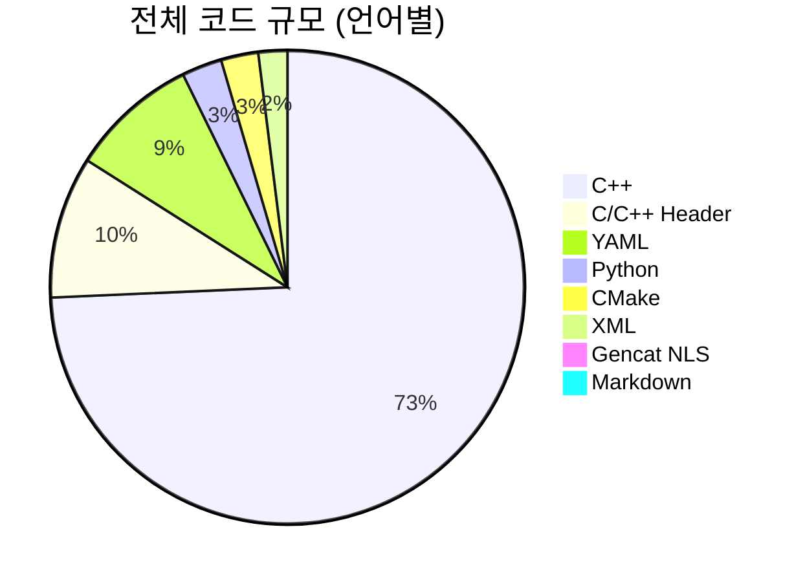
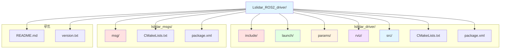
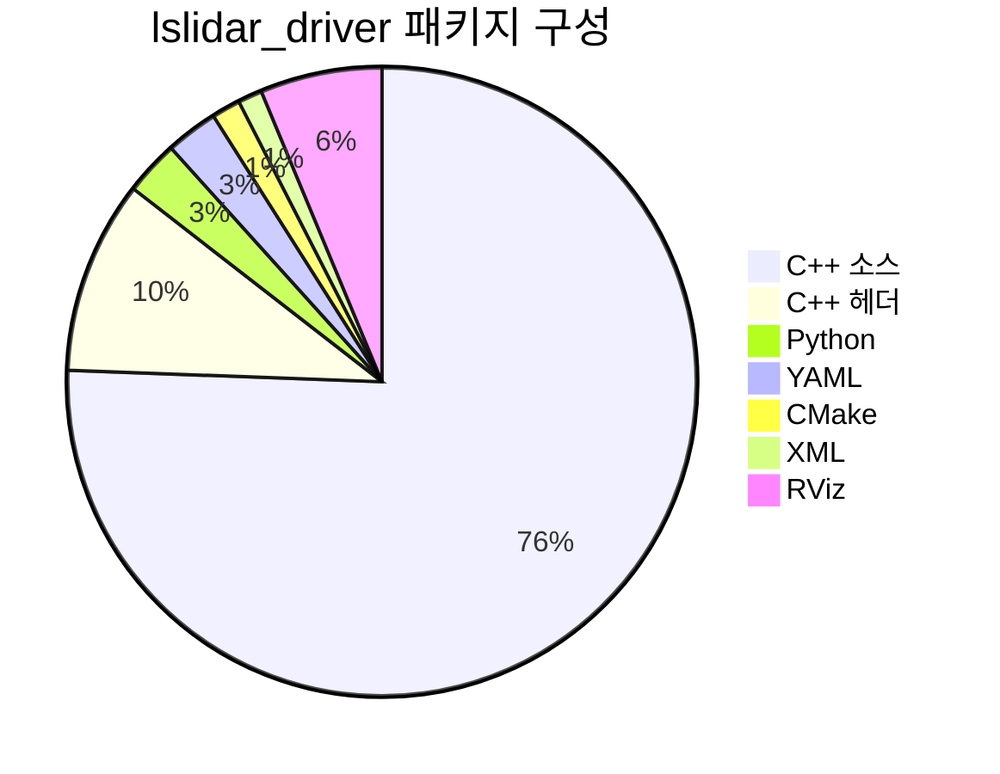
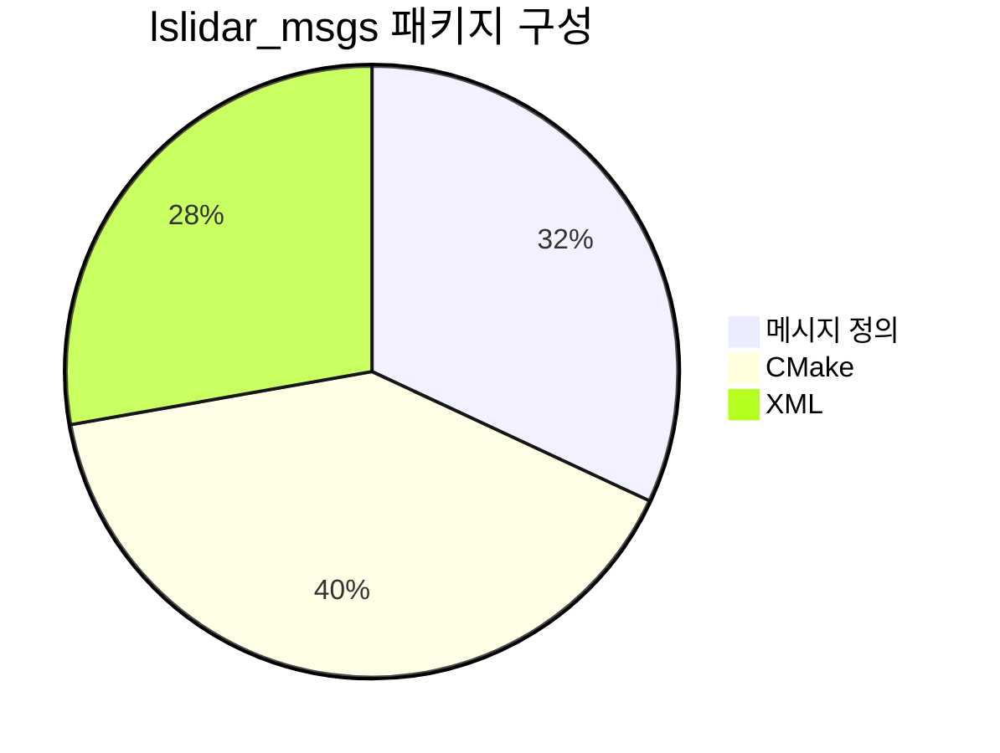
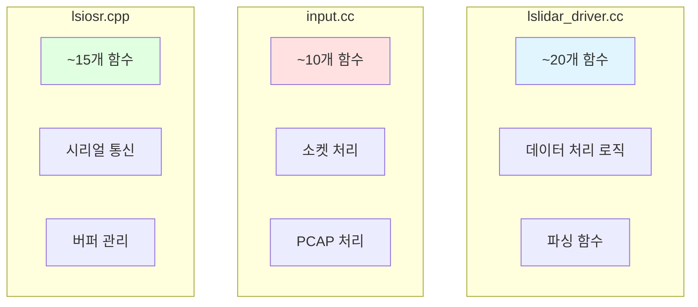
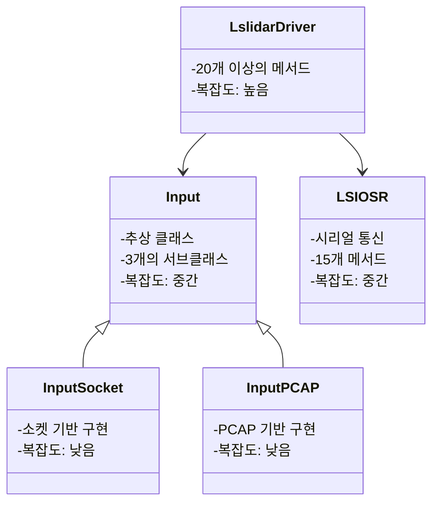
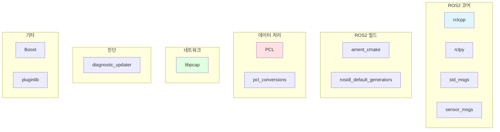
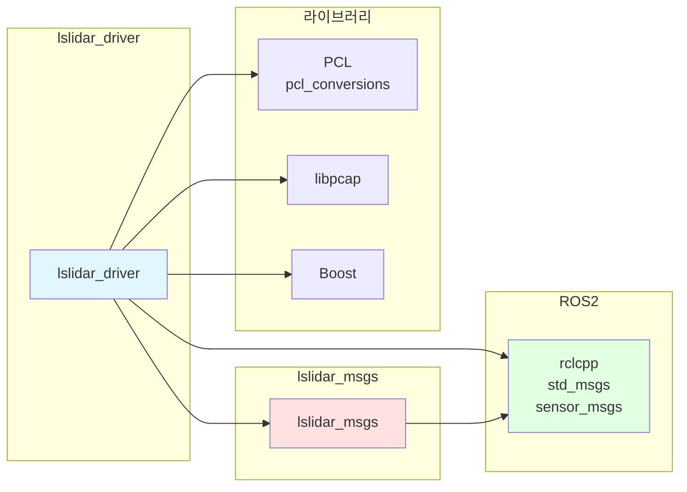
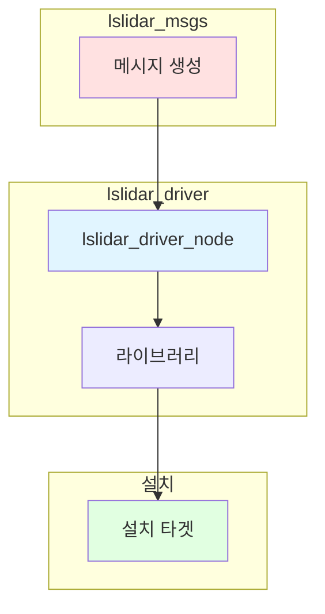
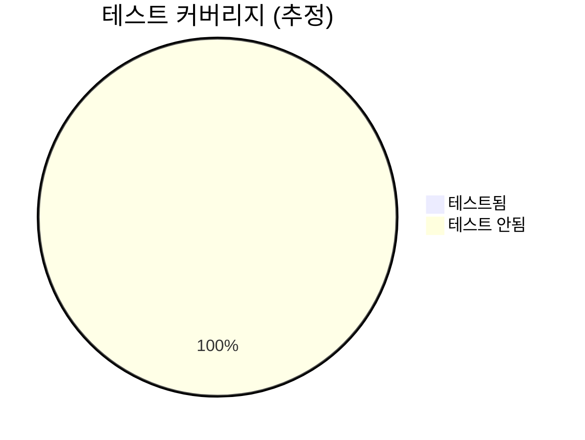

# Lslidar ROS2 Driver 코드 규모 및 구조 분석

## 개요

본 문서는 cloc 및 다양한 분석 도구를 사용하여 Lslidar ROS2 Driver 프로젝트의 코드 규모, 구조, 복잡도를 분석한 결과입니다.

## 전체 코드 규모

### cloc 분석 결과



### 전체 통계

| 항목 | 값 |
|------|-----|
| 총 파일 수 | 24개 |
| 총 라인 수 | 2,943줄 |
| 코드 라인 | 2,676줄 |
| 빈 라인 | 288줄 |
| 주석 라인 | 188줄 |
| 주석 비율 | 7.0% |

### 언어별 분석

| 언어 | 파일 수 | 코드 라인 | 빈 라인 | 주석 라인 | 비율 |
|------|---------|----------|---------|-----------|------|
| C++ | 4 | 1,955 | 161 | 100 | 73.1% |
| C/C++ Header | 3 | 255 | 53 | 73 | 9.5% |
| YAML | 4 | 230 | 0 | 6 | 8.6% |
| Python | 2 | 72 | 18 | 0 | 2.7% |
| CMake | 2 | 67 | 19 | 9 | 2.5% |
| XML | 2 | 52 | 9 | 0 | 1.9% |
| Gencat NLS | 5 | 23 | 6 | 0 | 0.9% |
| Markdown | 1 | 22 | 22 | 0 | 0.8% |

## 폴더 구조

### 전체 폴더 트리



### 상세 폴더 구조

```
Lslidar_ROS2_driver/
├── lslidar_driver/              # 드라이버 패키지
│   ├── include/
│   │   └── lslidar_driver/      # 헤더 파일
│   │       ├── lslidar_driver.h # 드라이버 헤더
│   │       ├── input.h          # 입력 클래스 헤더
│   │       └── lsiosr.h         # 시리얼 통신 헤더
│   ├── launch/                  # 런치 파일
│   │   ├── lslidar_launch.py    # 기본 런치 파일
│   │   └── lslidar_double_launch.py # 이중 라이다 런치
│   ├── params/                  # 파라미터 파일
│   │   ├── lsx10.yaml          # M10 파라미터
│   │   ├── lsx10_1.yaml        # M10_1 파라미터
│   │   └── lsx10_2.yaml        # M10_2 파라미터
│   ├── rviz/                    # RViz 설정
│   │   └── lslidar.rviz        # RViz 설정 파일
│   ├── src/                     # 소스 파일
│   │   ├── input.cc            # 입력 클래스 구현
│   │   ├── lsiosr.cpp          # 시리얼 통신 구현
│   │   ├── lslidar_driver.cc   # 드라이버 구현
│   │   └── lslidar_driver_node.cc # 노드 진입점
│   ├── CMakeLists.txt          # 빌드 설정
│   └── package.xml             # 패키지 메타데이터
├── lslidar_msgs/               # 메시지 패키지
│   ├── msg/                    # 메시지 정의
│   │   ├── LslidarDifop.msg    # DIFOP 메시지
│   │   ├── LslidarPacket.msg   # 패킷 메시지
│   │   ├── LslidarPoint.msg    # 포인트 메시지
│   │   ├── LslidarScan.msg     # 스캔 메시지
│   │   └── LslidarSweep.msg    # 스윕 메시지
│   ├── CMakeLists.txt          # 빌드 설정
│   └── package.xml             # 패키지 메타데이터
├── README.md                   # 프로젝트 설명
└── version.txt                 # 버전 정보
```

## 파일별 분석

### 상위 10개 파일 (라인 수 기준)

```mermaid
bar
    title 상위 10개 파일 라인 수
    section 소스 파일
    lslidar_driver.cc : 1383
    lsiosr.cpp : 400
    input.cc : 398
    section 헤더 파일
    lslidar_driver.h : 159
    input.h : 134
    lsiosr.h : 88
    section 기타
    CMakeLists.txt (driver) : 56
    lslidar_double_launch.py : 50
    lslidar_launch.py : 40
    CMakeLists.txt (msgs) : 39
```

### 파일별 상세 분석

| 파일 | 경로 | 라인 수 | 코드 | 빈 | 주석 | 언어 |
|------|------|---------|------|-----|------|------|
| lslidar_driver.cc | lslidar_driver/src/ | 1,383 | 1,273 | 75 | 35 | C++ |
| lsiosr.cpp | lslidar_driver/src/ | 400 | 326 | 49 | 25 | C++ |
| input.cc | lslidar_driver/src/ | 398 | 342 | 33 | 23 | C++ |
| lslidar_driver.h | lslidar_driver/include/ | 159 | 123 | 19 | 17 | C++ Header |
| input.h | lslidar_driver/include/ | 134 | 83 | 14 | 37 | C++ Header |
| lsiosr.h | lslidar_driver/include/ | 88 | 49 | 20 | 19 | C++ Header |
| lslidar_driver_node.cc | lslidar_driver/src/ | 35 | 14 | 4 | 17 | C++ |
| lslidar.rviz | lslidar_driver/rviz/ | 161 | 161 | 0 | 0 | Gencat NLS |
| lslidar_double_launch.py | lslidar_driver/launch/ | 50 | 41 | 9 | 0 | Python |
| lslidar_launch.py | lslidar_driver/launch/ | 40 | 31 | 9 | 0 | Python |
| CMakeLists.txt | lslidar_driver/ | 56 | 38 | 12 | 6 | CMake |
| package.xml | lslidar_driver/ | 35 | 32 | 4 | 0 | XML |
| lsx10.yaml | lslidar_driver/params/ | 24 | 23 | 0 | 2 | YAML |
| lsx10_1.yaml | lslidar_driver/params/ | 24 | 23 | 0 | 2 | YAML |
| lsx10_2.yaml | lslidar_driver/params/ | 24 | 23 | 0 | 2 | YAML |
| CMakeLists.txt | lslidar_msgs/ | 39 | 29 | 7 | 3 | CMake |
| package.xml | lslidar_msgs/ | 25 | 20 | 5 | 0 | XML |
| LslidarPoint.msg | lslidar_msgs/msg/ | 12 | 10 | 2 | 0 | Gencat NLS |
| LslidarScan.msg | lslidar_msgs/msg/ | 6 | 5 | 1 | 0 | Gencat NLS |
| LslidarPacket.msg | lslidar_msgs/msg/ | 5 | 3 | 2 | 0 | Gencat NLS |
| LslidarSweep.msg | lslidar_msgs/msg/ | 4 | 3 | 1 | 0 | Gencat NLS |
| LslidarDifop.msg | lslidar_msgs/msg/ | 2 | 2 | 0 | 0 | Gencat NLS |
| README.md | / | 45 | 22 | 22 | 0 | Markdown |

## 패키지별 분석

### lslidar_driver 패키지



| 항목 | 값 |
|------|-----|
| 총 파일 수 | 13개 |
| 총 라인 수 | 2,568줄 |
| 코드 라인 | 2,447줄 |
| 빈 라인 | 180줄 |
| 주석 라인 | 141줄 |
| 주석 비율 | 5.5% |

### lslidar_msgs 패키지



| 항목 | 값 |
|------|-----|
| 총 파일 수 | 7개 |
| 총 라인 수 | 72줄 |
| 코드 라인 | 72줄 |
| 빈 라인 | 0줄 |
| 주석 라인 | 0줄 |
| 주석 비율 | 0.0% |

## 복잡도 분석

### 함수 수 추정



### 클래스 구조



## 의존성 분석

### 외부 의존성



### 패키지 간 의존성



## 코드 품질 지표

### 주석 비율

```mermaid
bar
    title 파일별 주석 비율 (%)
    section 높음 (20%+)
    input.h : 27.6
    lsiosr.h : 21.6
    lslidar_driver.h : 10.7
    section 중간 (10-20%)
    lsiosr.cpp : 6.3
    input.cc : 5.8
    lslidar_driver.cc : 2.5
    section 낮음 (10% 미만)
    lslidar_driver_node.cc : 48.6
    CMakeLists.txt (driver) : 10.7
    CMakeLists.txt (msgs) : 7.7
```

### 복잡도 추정

| 파일 | 예상 복잡도 | 이유 |
|------|-------------|------|
| lslidar_driver.cc | 높음 | 1,383줄, 다양한 데이터 처리 로직 |
| lsiosr.cpp | 중간 | 400줄, 시리얼 통신 로직 |
| input.cc | 중간 | 398줄, 네트워크/PCAP 처리 |
| lslidar_driver.h | 중간 | 159줄, 다양한 멤버 변수/메서드 |
| input.h | 낮음 | 134줄, 추상 클래스 정의 |
| lsiosr.h | 낮음 | 88줄, 시리얼 통신 인터페이스 |

## 빌드 분석

### 빌드 타겟



### 빌드 시간 추정

| 단계 | 예상 시간 | 설명 |
|------|----------|------|
| 메시지 생성 | ~5초 | ROS2 메시지 생성 |
| 드라이버 컴파일 | ~30초 | C++ 소스 컴파일 |
| 링킹 | ~10초 | 라이브러리 링킹 |
| 설치 | ~5초 | 파일 설치 |
| **총계** | **~50초** | 전체 빌드 시간 |

## 테스트 커버리지

### 현재 상태



| 항목 | 상태 | 설명 |
|------|------|------|
| 단위 테스트 | 없음 | 테스트 파일 없음 |
| 통합 테스트 | 없음 | 테스트 파일 없음 |
| 시스템 테스트 | 수동 | 런치 파일로 수동 테스트 |

## 유지보수성 지표

### 유지보수성 점수

```mermaid
gauge
    title 유지보수성 점수 (추정)
    "코드 품질" : 65
    "문서화" : 70
    "테스트" : 20
    "복잡도" : 50
```

### 개선 권장사항

1. **테스트 추가**: 단위 테스트 및 통합 테스트 추가
2. **주석 개선**: 복잡한 로직에 대한 주석 추가
3. **코드 리팩토링**: 큰 함수를 더 작은 함수로 분리
4. **문서화**: API 문서 및 사용자 가이드 개선
5. **CI/CD**: 자동화된 테스트 및 빌드 파이프라인 구축

## 요약

### 주요 통계

| 항목 | 값 |
|------|-----|
| 총 파일 수 | 24개 |
| 총 라인 수 | 2,943줄 |
| 코드 라인 | 2,676줄 (90.9%) |
| 주석 라인 | 188줄 (6.4%) |
| 빈 라인 | 288줄 (9.8%) |
| 주요 언어 | C++ (82.6%) |
| 패키지 수 | 2개 |
| 클래스 수 | 5개 |
| 메시지 수 | 5개 |

### 프로젝트 특성

- **규모**: 소형 프로젝트
- **복잡도**: 중간
- **유지보수성**: 중간
- **테스트 커버리지**: 낮음
- **문서화**: 중간

### 강점

1. 명확한 패키지 구조
2. 잘 정의된 메시지 인터페이스
3. 다양한 입력 방식 지원 (소켓, PCAP)
4. ROS2 표준 준수

### 개선 필요 사항

1. 테스트 코드 추가
2. 주석 비율 향상
3. 코드 리팩토링
4. CI/CD 파이프라인 구축
5. 성능 최적화

## 참고 자료

- cloc: https://github.com/AlDanial/cloc
- ROS2 패키지 구조: https://docs.ros.org/en/foxy/Tutorials/Creating-Your-First-ROS2-Package.html
- C++ 코드 품질: https://isocpp.org/