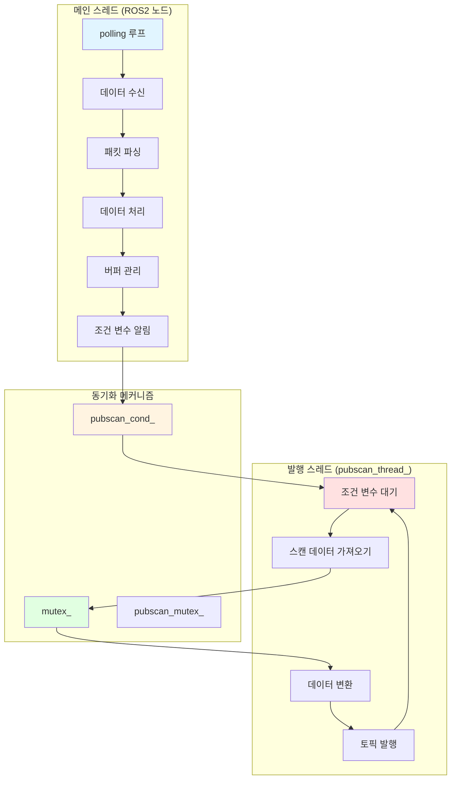
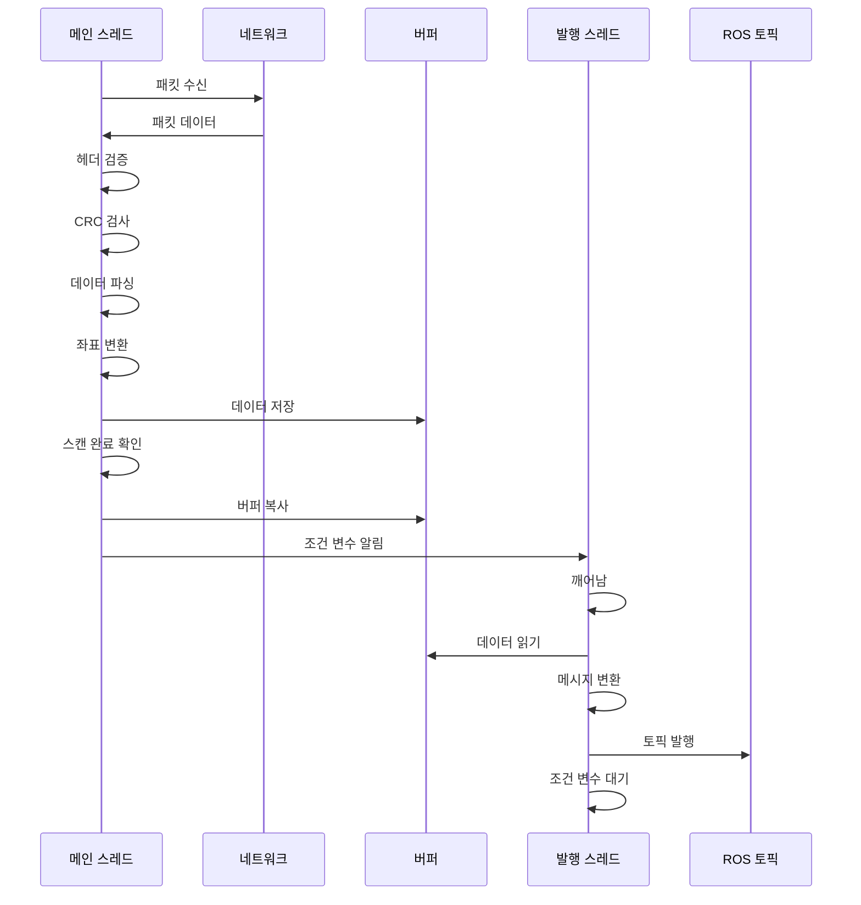
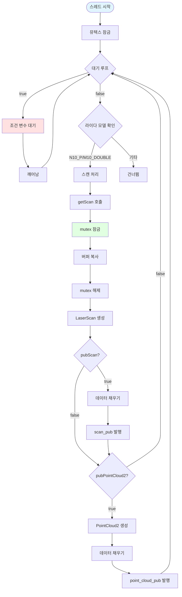
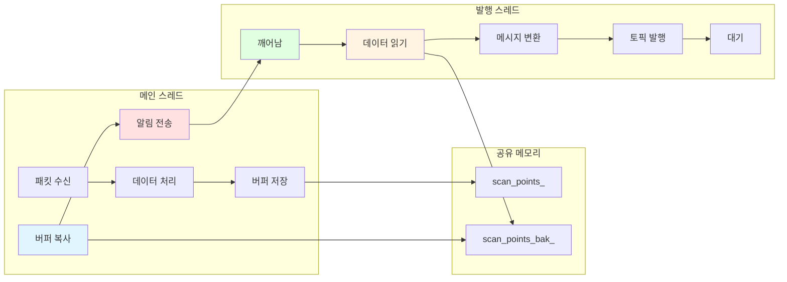
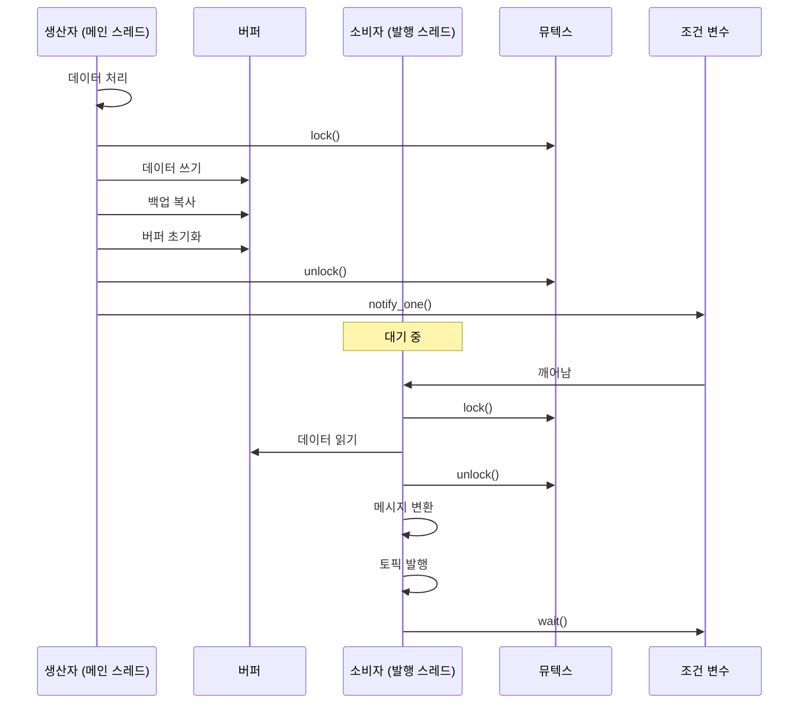

# Lslidar ROS2 Driver 스레드 수준 동작 분석

## 개요

본 문서는 Lslidar ROS2 Driver의 스레드 수준 동작을 상세히 분석한 것입니다. 이 드라이버는 생산자-소비자 패턴을 사용하여 라이다 데이터를 효율적으로 처리하고 발행합니다.

## 스레드 아키텍처



## 스레드 구성

### 1. 메인 스레드 (ROS2 노드 스레드)

**역할:** 라이다 데이터 수신 및 처리

**실행 함수:** `polling()`

**주요 작업:**
1. UDP/시리얼 포트에서 패킷 수신
2. 패킷 헤더 검증
3. CRC 검사
4. 데이터 파싱
5. 좌표 변환
6. 버퍼에 데이터 저장
7. 발행 스레드 알림

### 2. 발행 스레드 (pubscan_thread_)

**역할:** 처리된 스캔 데이터를 ROS 토픽으로 발행

**실행 함수:** `pubScanThread()`

**주요 작업:**
1. 조건 변수 대기
2. 스캔 데이터 가져오기
3. LaserScan 메시지 변환
4. PointCloud2 메시지 변환
5. 토픽 발행

## 스레드 생성 및 초기화

### 스레드 생성

```cpp
// lslidar_driver.cc:60
pubscan_thread_ = new boost::thread(boost::bind(&LslidarDriver::pubScanThread, this));
```

**설명:**
- `loadParameters()` 함수에서 발행 스레드 생성
- `boost::thread` 사용
- `pubScanThread()` 멤버 함수를 스레드 함수로 바인딩

### 스레드 동기화 객체

```cpp
// lslidar_driver.h:87-91
boost::thread *pubscan_thread_;      // 발행 스레드
boost::mutex mutex_;                  // 데이터 버퍼 보호
boost::mutex pubscan_mutex_;          // 발행 스레드 보호
boost::condition_variable pubscan_cond_;  // 조건 변수
```

## 스레드 동작 시퀀스

### 메인 스레드 동작 흐름



### 발행 스레드 동작 흐름



## 상세 동작 분석

### 1. 메인 스레드: polling() 함수

```cpp
bool LslidarDriver::polling()
{
    if (!is_start)
        return true;
    
    // 패킷 버퍼 할당
    unsigned char *packet_bytes = new unsigned char[500];
    int len = 0;
    bool difop = false;
    
    if (interface_selection == "net")
    {
        // 네트워크 인터페이스
        auto packet = lslidar_msgs::msg::LslidarPacket::UniquePtr(
            new lslidar_msgs::msg::LslidarPacket());
        
        while (true)
        {
            // 패킷 수신
            len = msop_input_->getPacket(packet);
            
            // 헤더 검증
            if (packet->data[0] == 0x5a)
            {
                // 헤더 조정
                for (int i = len - 1; i > 0; i--)
                    packet->data[i] = packet->data[i - 1];
                packet->data[0] = 0xa5;
            }
            
            // 패킷 길이 확인
            if (len <= 0 || len >= 1000 || 
                packet->data[0] != 0xa5 || 
                packet->data[1] != 0x5a)
                continue;
            
            // CRC 검사
            if (packet_bytes[len - 1] != N10_CalCRC8(packet_bytes, len - 1))
                continue;
            
            break;
        }
    }
    else
    {
        // 시리얼 인터페이스
        len = receive_data(packet_bytes);
    }
    
    // 데이터 처리
    if (difop)
        difop_processing(packet_bytes);
    else
        data_processing(packet_bytes, len);
    
    return true;
}
```

**주요 포인트:**
- 무한 루프로 패킷 수신
- 헤더 검증 및 CRC 검사
- 유효한 패킷만 처리
- 네트워크/시리얼 인터페이스 지원

### 2. 데이터 처리: data_processing() 함수

```cpp
void LslidarDriver::data_processing(unsigned char *packet_bytes, int len)
{
    // 패킷 파싱
    double degree = (s * 256 + z) / 100.f + degree_compensation;
    
    // 포인트 데이터 처리
    for (int num = 0; num < point_len * package_points; num += point_len)
    {
        // 거리 및 강도 파싱
        int s = packet_bytes[num + data_bits_start];
        int z = packet_bytes[num + data_bits_start + 1];
        double distance = (s * 256 + z) / 1000.0;
        
        // 좌표 변환
        scan_points_[idx].x = distance * cos(degree * M_PI / 180.0);
        scan_points_[idx].y = distance * sin(degree * M_PI / 180.0);
        scan_points_[idx].z = 0;
        scan_points_[idx].degree = degree;
        scan_points_[idx].range = distance;
        scan_points_[idx].intensity = intensity;
        
        idx++;
    }
    
    // 스캔 완료 확인
    if ((scan_points_[idx].degree < last_degree && 
         scan_points_[idx].degree < 5 && 
         last_degree > 355) || idx >= points_size_)
    {
        // 스캔 완료
        last_degree = scan_points_[idx].degree;
        count_num = idx;
        idx = 0;
        
        // 데이터 필터링
        for (long unsigned int k = 0; k < scan_points_.size(); k++)
        {
            if (scan_points_[k].range < min_range || 
                scan_points_[k].range > max_range)
                scan_points_[k].range = 0;
        }
        
        // 버퍼 복사 (스레드 안전)
        {
            boost::unique_lock<boost::mutex> lock(mutex_);
            scan_points_bak_.resize(scan_points_.size());
            scan_points_bak_.assign(scan_points_.begin(), scan_points_.end());
            
            // 버퍼 초기화
            for (long unsigned int k = 0; k < scan_points_.size(); k++)
            {
                scan_points_[k].range = 0;
                scan_points_[k].degree = 0;
                scan_points_[k].intensity = 0;
            }
            
            pre_time_ = time_;
        }
        
        // 발행 스레드 알림
        pubscan_cond_.notify_one();
        
        time_ = get_clock()->now();
    }
}
```

**주요 포인트:**
- 패킷에서 포인트 데이터 파싱
- 극좌표에서 직교좌표로 변환
- 스캔 완료 감지 (방위각 360도 회전)
- 뮤텍스로 보호된 버퍼 복사
- 조건 변수로 발행 스레드 알림

### 3. 발행 스레드: pubScanThread() 함수

```cpp
void LslidarDriver::pubScanThread()
{
    bool wait_for_wake = true;
    boost::unique_lock<boost::mutex> lock(pubscan_mutex_);
    
    while (rclcpp::ok())
    {
        // 조건 변수 대기
        while (wait_for_wake)
        {
            pubscan_cond_.wait(lock);
            wait_for_wake = false;
        }
        
        // 라이다 모델별 처리
        if (lidar_name == "N10_P" || lidar_name == "M10_DOUBLE")
        {
            // LaserScan 발행
            if (pubScan)
            {
                auto scan = sensor_msgs::msg::LaserScan::UniquePtr(
                    new sensor_msgs::msg::LaserScan());
                
                // 스캔 데이터 가져오기
                std::vector<ScanPoint> points;
                rclcpp::Time start_time;
                float scan_time;
                this->getScan(points, start_time, scan_time);
                
                // 메시지 설정
                scan->header.frame_id = frame_id;
                scan->header.stamp = use_gps_ts ? 
                    rclcpp::Time(sweep_end_time_gps, sweep_end_time_hardware) : 
                    this->now();
                
                scan->angle_min = 0;
                scan->angle_max = 2 * M_PI;
                scan->angle_increment = 2 * M_PI / (double)(count_num);
                scan->range_min = min_range;
                scan->range_max = max_range;
                
                // 데이터 채우기
                for (int i = 0; i < count_num; i++)
                {
                    int point_idx = round((360 - points[i].degree) * count_num / 360);
                    scan->ranges[point_idx] = (float)points[i].range;
                    scan->intensities[point_idx] = points[i].intensity;
                }
                
                // 토픽 발행
                scan_pub->publish(std::move(scan));
            }
            
            // PointCloud2 발행
            if (pubPointCloud2)
            {
                // 유사한 로직으로 PointCloud2 발행
                point_cloud_pub->publish(std::move(point_cloud));
            }
        }
        
        wait_for_wake = true;
    }
}
```

**주요 포인트:**
- 조건 변수로 대기/깨어남
- getScan()으로 스레드 안전하게 데이터 가져오기
- LaserScan 및 PointCloud2 메시지 변환
- ROS 토픽 발행

### 4. 스레드 안전한 데이터 접근: getScan() 함수

```cpp
int LslidarDriver::getScan(std::vector<ScanPoint> &points, 
                            rclcpp::Time &scan_time, 
                            float &scan_duration)
{
    // 뮤텍스 잠금
    boost::unique_lock<boost::mutex> lock(mutex_);
    
    // 버퍼 복사
    points.assign(scan_points_bak_.begin(), scan_points_bak_.end());
    scan_time = pre_time_;
    scan_duration = time_.seconds() - pre_time_.seconds();
    
    return 1;
}
```

**주요 포인트:**
- 뮤텍스로 보호된 데이터 접근
- 백업 버퍼에서 데이터 복사
- 원자적 연산 보장

## 동기화 메커니즘

### 뮤텍스 (mutex_)

**용도:** scan_points_와 scan_points_bak_ 사이의 데이터 복사 보호

**잠금 구간:**
```cpp
// 데이터 처리 스레드
{
    boost::unique_lock<boost::mutex> lock(mutex_);
    scan_points_bak_.resize(scan_points_.size());
    scan_points_bak_.assign(scan_points_.begin(), scan_points_.end());
    // ... 버퍼 초기화
}

// 발행 스레드
int LslidarDriver::getScan(...)
{
    boost::unique_lock<boost::mutex> lock(mutex_);
    points.assign(scan_points_bak_.begin(), scan_points_bak_.end());
    // ...
}
```

### 뮤텍스 (pubscan_mutex_)

**용도:** 발행 스레드의 조건 변수 대기 보호

**잠금 구간:**
```cpp
void LslidarDriver::pubScanThread()
{
    boost::unique_lock<boost::mutex> lock(pubscan_mutex_);
    
    while (rclcpp::ok())
    {
        while (wait_for_wake)
        {
            pubscan_cond_.wait(lock);  // 잠금 해제 및 대기
            wait_for_wake = false;
        }
        // ... 데이터 처리
    }
}
```

### 조건 변수 (pubscan_cond_)

**용도:** 발행 스레드를 깨우는 신호

**사용 패턴:**
```cpp
// 데이터 처리 스레드 (신호 보내기)
{
    boost::unique_lock<boost::mutex> lock(mutex_);
    // ... 데이터 복사
    lock.unlock();
    pubscan_cond_.notify_one();  // 대기 중인 스레드 깨우기
}

// 발행 스레드 (신호 대기)
{
    boost::unique_lock<boost::mutex> lock(pubscan_mutex_);
    while (wait_for_wake)
    {
        pubscan_cond_.wait(lock);  // 신호 대기
    }
}
```

## 스레드 간 통신

### 데이터 흐름



### 생산자-소비자 패턴



## 성능 특성

### 스레드 성능

| 항목 | 값 | 설명 |
|------|-----|------|
| 메인 스레드 주기 | 10-20 Hz | 라이다 RPM에 따라 |
| 발행 스레드 주기 | 10-20 Hz | 스캔 완료 시 |
| 락 경합 시간 | < 1ms | 버퍼 복사 |
| 대기 시간 | 0-100ms | 스캔 간격 |

### 동기화 오버헤드

```mermaid
gantt
    title 스레드 동기화 타이밍
    dateFormat s
    
    section 메인 스레드
    데이터 처리 :0, 0.04
    뮤텍스 잠금 :0.04, 0.001
    버퍼 복사 :0.041, 0.0005
    뮤텍스 해제 :0.0415, 0.0005
    알림 전송 :0.042, 0.0005
    
    section 발행 스레드
    조건 변수 대기 :0, 0.04
    깨어남 :0.04, 0.0005
    뮤텍스 잠금 :0.0405, 0.001
    데이터 읽기 :0.0415, 0.0005
    뮤텍스 해제 :0.042, 0.0005
    메시지 변환 :0.0425, 0.01
    토픽 발행 :0.0525, 0.005
```

## 잠재적 문제 및 해결책

### 1. 경쟁 조건 (Race Condition)

**문제:** 버퍼 복사 중 데이터 읽기 시도

**해결책:** 뮤텍스로 보호

```cpp
// 안전한 접근
{
    boost::unique_lock<boost::mutex> lock(mutex_);
    scan_points_bak_.assign(scan_points_.begin(), scan_points_.end());
}
```

### 2. 데드락 (Deadlock)

**문제:** 뮤텍스 순서 오류

**해결책:** 일관된 잠금 순서

```cpp
// 올바른 순서
// 1. mutex_ 잠금
// 2. 데이터 복사
// 3. mutex_ 해제
// 4. 조건 변수 알림
```

### 3. 기아 (Starvation)

**문제:** 발행 스레드가 계속 대기

**해결책:** 조건 변수로 신호 보장

```cpp
// 스캔 완료 시 항상 알림
pubscan_cond_.notify_one();
```

### 4. 스피너 (Spurious Wakeup)

**문제:** 조건 변수가 잘못 깨어남

**해결책:** 플래그 확인

```cpp
while (wait_for_wake)
{
    pubscan_cond_.wait(lock);
    wait_for_wake = false;
}
```

## 최적화 제안

### 1. 더블 버퍼링

**현재:** 단일 백업 버퍼

**제안:** 더블 버퍼링으로 지연 감소

```cpp
// 제안 구조
std::vector<ScanPoint> buffer1_;
std::vector<ScanPoint> buffer2_;
std::vector<ScanPoint>* active_buffer_;
std::vector<ScanPoint>* backup_buffer_;
```

### 2. 락 프리 (Lock-Free) 큐

**현재:** 뮤텍스 사용

**제안:** 락 프리 큐로 오버헤드 감소

```cpp
// 제안 구조
boost::lockfree::queue<ScanData> scan_queue_;
```

### 3. 비동기 발행

**현재:** 동기 토픽 발행

**제안:** 비동기 발행으로 지연 감소

```cpp
// 제안 구조
rclcpp::Publisher<sensor_msgs::msg::LaserScan>::AsyncPublisher async_pub_;
```

## 디버깅 및 모니터링

### 스레드 상태 모니터링

```cpp
// 스레드 상태 확인
bool is_main_thread_running = rclcpp::ok();
bool is_pub_thread_running = pubscan_thread_ != nullptr;
```

### 락 경합 시간 측정

```cpp
// 락 경합 시간 측정
auto start = std::chrono::high_resolution_clock::now();
{
    boost::unique_lock<boost::mutex> lock(mutex_);
    // ... 작업
}
auto end = std::chrono::high_resolution_clock::now();
auto duration = std::chrono::duration_cast<std::chrono::microseconds>(end - start);
```

### 조건 변수 대기 시간 측정

```cpp
// 대기 시간 측정
auto wait_start = std::chrono::high_resolution_clock::now();
pubscan_cond_.wait(lock);
auto wait_end = std::chrono::high_resolution_clock::now();
auto wait_duration = std::chrono::duration_cast<std::chrono::milliseconds>(wait_end - wait_start);
```

## 요약

### 스레드 구성

| 스레드 | 역할 | 주요 함수 | 동기화 |
|--------|------|----------|----------|
| 메인 스레드 | 데이터 수신/처리 | polling() | mutex_, pubscan_cond_ |
| 발행 스레드 | 토픽 발행 | pubScanThread() | pubscan_mutex_, pubscan_cond_ |

### 동기화 객체

| 객체 | 타입 | 용도 |
|------|------|------|
| mutex_ | boost::mutex | 버퍼 보호 |
| pubscan_mutex_ | boost::mutex | 조건 변수 보호 |
| pubscan_cond_ | boost::condition_variable | 스레드 간 통신 |

### 데이터 흐름

1. **메인 스레드:** 패킷 수신 → 파싱 → 변환 → 버퍼 저장 → 알림
2. **발행 스레드:** 대기 → 깨어남 → 데이터 읽기 → 변환 → 발행 → 대기

### 주요 특징

- **생산자-소비자 패턴:** 효율적인 데이터 처리
- **조건 변수:** 이벤트 기반 동기화
- **불교 락:** 최소 오버헤드
- **스레드 안전:** 뮤텍스 보호

## 참고 자료

- Boost.Thread: https://www.boost.org/doc/libs/release/libs/thread/
- ROS2 Threading: https://docs.ros.org/en/foxy/Tutorials/Threading/Creating-A-Multi-Threaded-Executor.html
- C++ Concurrency: https://en.cppreference.com/w/cpp/thread