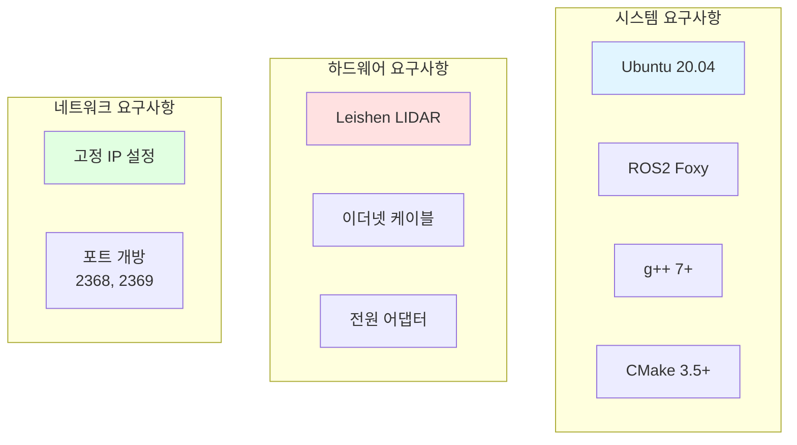
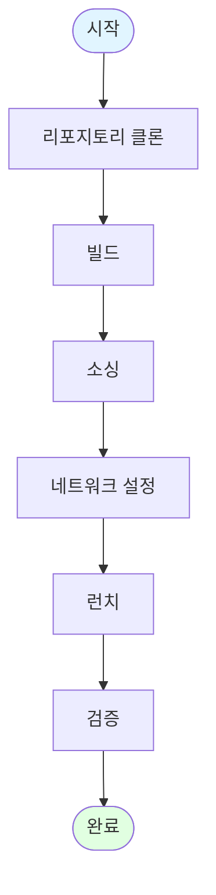
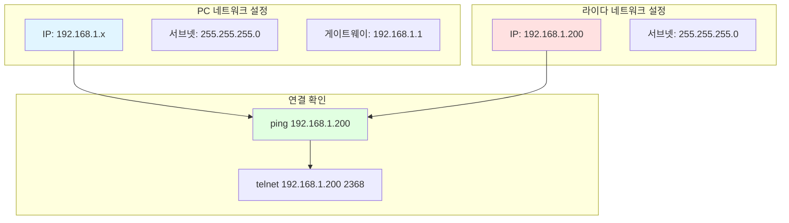
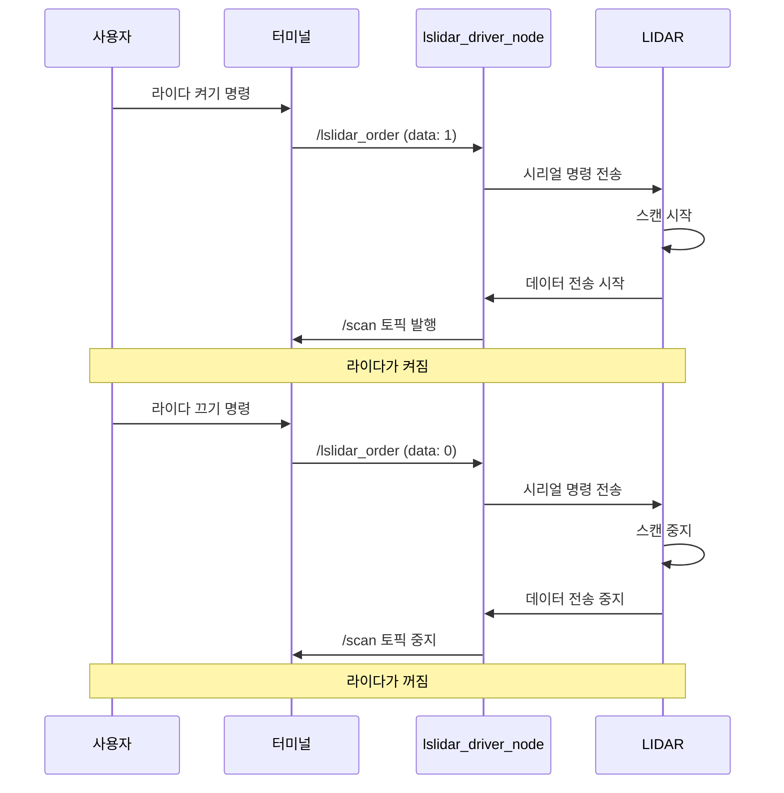
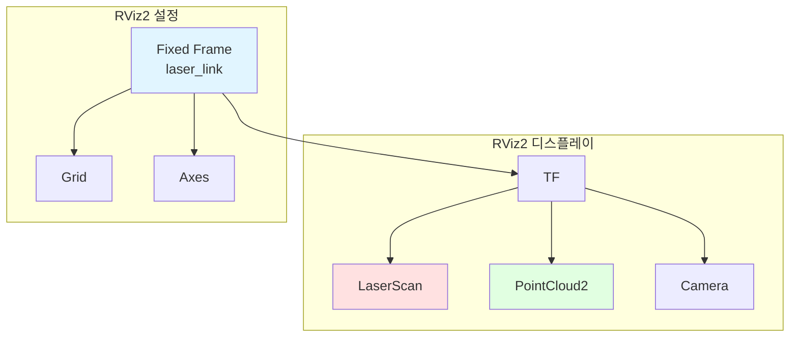
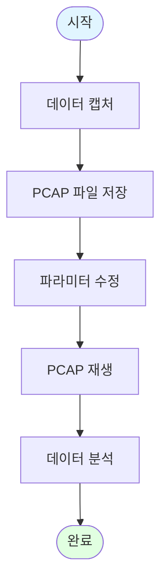
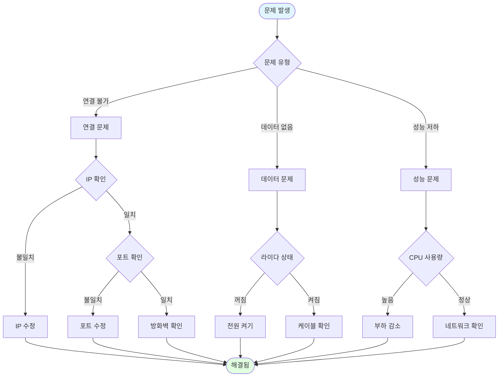

# Lslidar ROS2 Driver 사용 가이드

## 빠른 시작

### 1. 사전 요구사항



### 2. 설치 절차



#### 명령어

```bash
# 1. 워크스페이스 생성 및 클론
mkdir -p ~/lslidar_ws/src
cd ~/lslidar_ws/src
git clone https://github.com/declue/Lslidar_ROS2_driver.git

# 2. 의존성 설치
cd ~/lslidar_ws
rosdep install --from-paths src --ignore-src -r -y

# 3. 빌드
colcon build --symlink-install

# 4. 소싱
source install/setup.bash

# 5. 런치
ros2 launch lslidar_driver lslidar_launch.py
```

## 네트워크 설정

### IP 설정



#### 네트워크 설정 명령어

```bash
# 임시 IP 설정 (재부팅 시 초기화)
sudo ip addr add 192.168.1.100/24 dev eth0

# 영구 IP 설정 (Netplan 사용)
sudo nano /etc/netplan/01-network-manager-all.yaml

# 내용:
network:
  version: 2
  renderer: NetworkManager
  ethernets:
    eth0:
      dhcp4: no
      addresses:
        - 192.168.1.100/24

# 적용
sudo netplan apply

# 연결 확인
ping 192.168.1.200
```

## 파라미터 설정

### 파라미터 파일 구조

```mermaid
graph TB
    subgraph "lsx10.yaml"
        NET[네트워크 설정]
        SERIAL[시리얼 설정]
        LIDAR[라이다 설정]
        DATA[데이터 설정]
        TOPIC[토픽 설정]
    end

    subgraph "네트워크 설정"
        DEV_IP[device_ip]
        MSOP_PORT[msop_port]
        DIFOP_PORT[difop_port]
        GROUP_IP[group_ip]
    end

    subgraph "시리얼 설정"
        SERIAL_PORT[serial_port_]
        INTERFACE[interface_selection]
    end

    subgraph "라이다 설정"
        LIDAR_NAME[lidar_name]
        FRAME_ID[frame_id]
        HIGH_REF[high_reflection]
        COMPENSATION[compensation]
    end

    subgraph "데이터 설정"
        MIN_RANGE[min_range]
        MAX_RANGE[max_range]
        ANGLE_MIN[angle_disable_min]
        ANGLE_MAX[angle_disable_max]
        USE_GPS[use_gps_ts]
    end

    subgraph "토픽 설정"
        SCAN_TOPIC[scan_topic]
        PC_TOPIC[pointcloud_topic]
        PUB_SCAN[pubScan]
        PUB_PC[pubPointCloud2]
    end

    NET --> DEV_IP
    NET --> MSOP_PORT
    NET --> DIFOP_PORT
    NET --> GROUP_IP

    SERIAL --> SERIAL_PORT
    SERIAL --> INTERFACE

    LIDAR --> LIDAR_NAME
    LIDAR --> FRAME_ID
    LIDAR --> HIGH_REF
    LIDAR --> COMPENSATION

    DATA --> MIN_RANGE
    DATA --> MAX_RANGE
    DATA --> ANGLE_MIN
    DATA --> ANGLE_MAX
    DATA --> USE_GPS

    TOPIC --> SCAN_TOPIC
    TOPIC --> PC_TOPIC
    TOPIC --> PUB_SCAN
    TOPIC --> PUB_PC

    style NET fill:#e1f5ff
    style SERIAL fill:#ffe1e1
    style LIDAR fill:#e1ffe1
    style DATA fill:#fff4e1
    style TOPIC fill:#f4e1ff
```



### 파라미터 상세 설명

#### 네트워크 파라미터

| 파라미터 | 타입 | 기본값 | 설명 |
|---------|------|--------|------|
| `device_ip` | string | 192.168.1.200 | 라이다 IP 주소 |
| `device_ip_difop` | string | 192.168.1.102 | DIFOP IP 주소 |
| `msop_port` | int | 2368 | MSOP 데이터 포트 |
| `difop_port` | int | 2369 | DIFOP 데이터 포트 |
| `group_ip` | string | 224.1.1.2 | 멀티캐스트 그룹 IP |
| `add_multicast` | bool | false | 멀티캐스트 사용 여부 |

#### 시리얼 파라미터

| 파라미터 | 타입 | 기본값 | 설명 |
|---------|------|--------|------|
| `interface_selection` | string | serial | 인터페이스 선택 (net/serial) |
| `serial_port_` | string | /dev/ttyUSB0 | 시리얼 포트 경로 |

#### 라이다 파라미터

| 파라미터 | 타입 | 기본값 | 설명 |
|---------|------|--------|------|
| `lidar_name` | string | M10 | 라이다 모델 |
| `frame_id` | string | laser_link | 좌표 프레임 ID |
| `high_reflection` | bool | false | 고반사 모드 (M10_P) |
| `compensation` | bool | false | 각도 보정 사용 |

#### 데이터 파라미터

| 파라미터 | 타입 | 기본값 | 설명 |
|---------|------|--------|------|
| `min_range` | double | 0.0 | 최소 거리 (m) |
| `max_range` | double | 200.0 | 최대 거리 (m) |
| `angle_disable_min` | double | 0.0 | 비활성 각도 시작 (도) |
| `angle_disable_max` | double | 0.0 | 비활성 각도 끝 (도) |
| `use_gps_ts` | bool | false | GPS 타임스탬프 사용 |

#### 토픽 파라미터

| 파라미터 | 타입 | 기본값 | 설명 |
|---------|------|--------|------|
| `scan_topic` | string | /scan | LaserScan 토픽 이름 |
| `pointcloud_topic` | string | /lslidar_point_cloud | PointCloud2 토픽 이름 |
| `pubScan` | bool | true | LaserScan 발행 여부 |
| `pubPointCloud2` | bool | false | PointCloud2 발행 여부 |

## 라이다 제어

### 라이다 켜기/끄기



#### 명령어

```bash
# 라이다 켜기
ros2 topic pub -1 /lslidar_order std_msgs/msg/Int8 "data: 1"

# 라이다 끄기
ros2 topic pub -1 /lslidar_order std_msgs/msg/Int8 "data: 0"
```

## 토픽 확인

### 토픽 목록

```mermaid
graph TB
    subgraph "발행 토픽"
        SCAN[/scan<br/>sensor_msgs/LaserScan]
        PC[/lslidar_point_cloud<br/>sensor_msgs/PointCloud2]
        DIAG[/diagnostics<br/>diagnostic_msgs]
    end

    subgraph "구독 토픽"
        ORDER[/lslidar_order<br/>std_msgs/Int8]
    end

    subgraph "서비스"
        LIFECYCLE[/lslidar_driver_node<br/>lifecycle_msgs]
    end

    style SCAN fill:#e1f5ff
    style PC fill:#ffe1e1
    style DIAG fill:#e1ffe1
    style ORDER fill:#fff4e1
```

#### 토픽 확인 명령어

```bash
# 토픽 목록 확인
ros2 topic list

# 토픽 정보 확인
ros2 topic info /scan
ros2 topic info /lslidar_point_cloud

# 토픽 데이터 확인
ros2 topic echo /scan
ros2 topic echo /lslidar_point_cloud

# 토픽 주파수 확인
ros2 topic hz /scan
ros2 topic hz /lslidar_point_cloud
```

## 시각화

### RViz2 설정



#### RViz2 실행

```bash
# 런치 파일과 함께 RViz2 실행
ros2 launch lslidar_driver lslidar_launch.py

# 별도 터미널에서 RViz2 실행
rviz2

# RViz2 설정 파일 로드
rviz2 -d ~/lslidar_ws/src/lslidar_driver/rviz/lslidar.rviz
```

## PCAP 재생

### PCAP 파일 사용



#### PCAP 캡처

```bash
# tcpdump로 패킷 캡처
sudo tcpdump -i eth0 -w lslidar.pcap port 2368 or port 2369

# Wireshark로 캡처
wireshark
```

#### PCAP 재생 설정

```yaml
# lsx10.yaml 수정
pcap: /path/to/lslidar.pcap
```

## 진단 및 디버깅

### 진단 토픽

```mermaid
graph TB
    subgraph "진단 시스템"
        DIAG_UPDATER[diagnostic_updater]
        DIAG_TOPIC[/diagnostics]
    end

    subgraph "진단 항목"
        HARDWARE[하드웨어 상태]
        COMMUNICATION[통신 상태]
        DATA[데이터 품질]
    end

    subgraph "진단 레벨"
        OK[OK]
        WARN[WARNING]
        ERROR[ERROR]
        STALE[STALE]
    end

    DIAG_UPDATER --> DIAG_TOPIC
    DIAG_TOPIC --> HARDWARE
    DIAG_TOPIC --> COMMUNICATION
    DIAG_TOPIC --> DATA

    HARDWARE --> OK
    HARDWARE --> WARN
    HARDWARE --> ERROR
    HARDWARE --> STALE

    style DIAG_UPDATER fill:#e1f5ff
    style OK fill:#e1ffe1
    style WARN fill:#fff4e1
    style ERROR fill:#ffe1e1
```

#### 진단 확인

```bash
# 진단 토픽 확인
ros2 topic echo /diagnostics

# rqt_console로 진단 확인
ros2 run rqt_console rqt_console
```

### 로그 확인

```bash
# ROS2 로그 레벨 설정
ros2 run lslidar_driver lslidar_driver_node --ros-args --log-level debug

# 로그 파일 확인
ls ~/.ros/log/
```

## 문제 해결

### 일반적인 문제



### 자주 묻는 질문

#### Q: 라이다가 연결되지 않습니다.

A: 다음을 확인하세요:
1. IP 주소가 올바른지 확인
2. 이더넷 케이블 연결 확인
3. 방화벽 설정 확인
4. 라이다 전원 확인

```bash
# 연결 확인
ping 192.168.1.200

# 포트 확인
netstat -an | grep 2368
```

#### Q: 데이터가 수신되지 않습니다.

A: 다음을 확인하세요:
1. 라이다가 켜져 있는지 확인
2. `/lslidar_order` 토픽으로 라이다 켜기
3. 파라미터 설정 확인

```bash
# 라이다 켜기
ros2 topic pub -1 /lslidar_order std_msgs/msg/Int8 "data: 1"

# 토픽 확인
ros2 topic list
```

#### Q: 성능이 저하됩니다.

A: 다음을 확인하세요:
1. CPU 사용량 확인
2. 네트워크 대역폭 확인
3. 불필요한 토픽 비활성화

```bash
# CPU 사용량 확인
top

# 네트워크 확인
iftop
```

## 고급 사용법

### 멀티 라이다 설정

```mermaid
graph TB
    subgraph "라이다 1"
        L1[LIDAR 1<br/>192.168.1.200]
        N1[Node 1<br/>lslidar_driver_node_1]
        T1[/scan1]
    end

    subgraph "라이다 2"
        L2[LIDAR 2<br/>192.168.1.201]
        N2[Node 2<br/>lslidar_driver_node_2]
        T2[/scan2]
    end

    subgraph "통합"
        FUSE[센서 퓨전]
        MAP[맵핑]
    end

    L1 --> N1
    N1 --> T1
    L2 --> N2
    N2 --> T2

    T1 --> FUSE
    T2 --> FUSE
    FUSE --> MAP

    style L1 fill:#e1f5ff
    style L2 fill:#ffe1e1
    style FUSE fill:#e1ffe1
```

### 커스텀 파라미터 파일

```yaml
# custom_lidar.yaml
/lslidar_driver_node:
  ros__parameters:
    frame_id: custom_laser_link
    device_ip: 192.168.1.200
    msop_port: 2368
    lidar_name: M10
    min_range: 0.5
    max_range: 100.0
    angle_disable_min: 45.0
    angle_disable_max: 135.0
    pubScan: true
    pubPointCloud2: true
```

```bash
# 커스텀 파라미터로 실행
ros2 launch lslidar_driver lslidar_launch.py params_file:=/path/to/custom_lidar.yaml
```

## 참고 자료

- ROS2 문서: https://docs.ros.org/
- RViz2 튜토리얼: https://docs.ros.org/en/foxy/Tutorials/Rviz2/Rviz2.html
- Leishen 라이다 지원: honghangli@lslidar.com